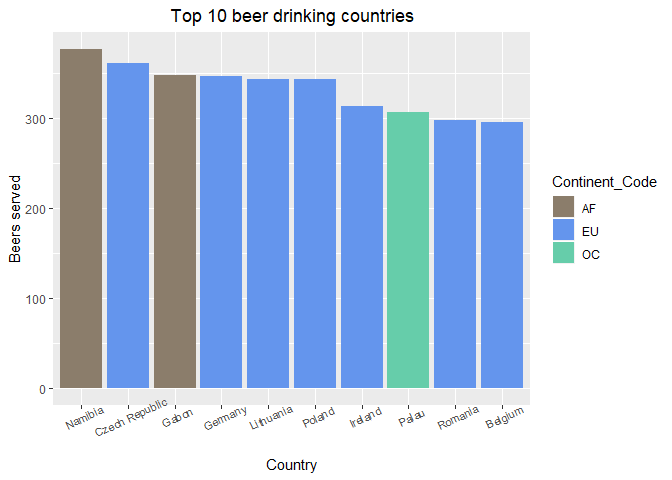
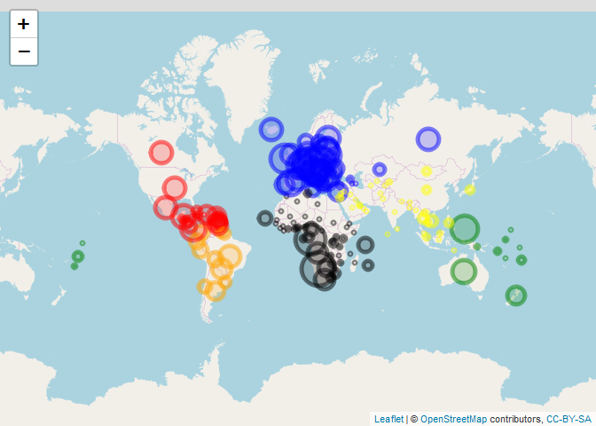
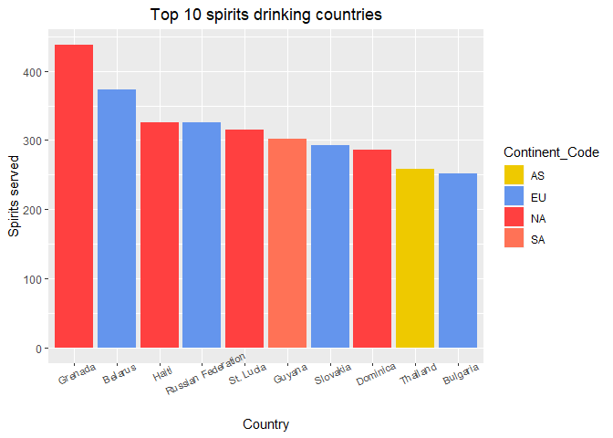
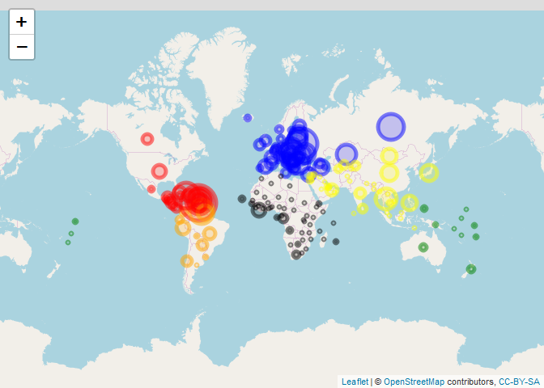
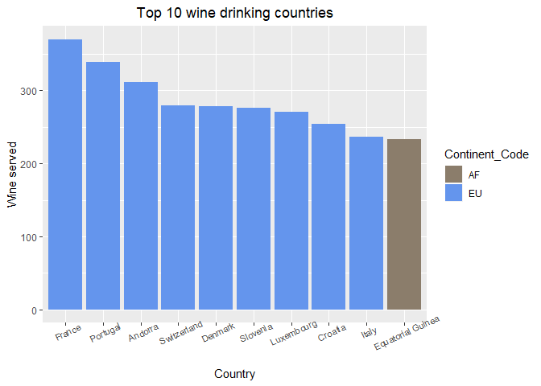
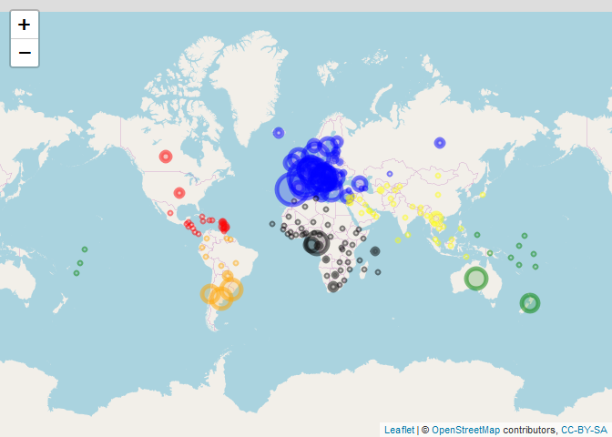
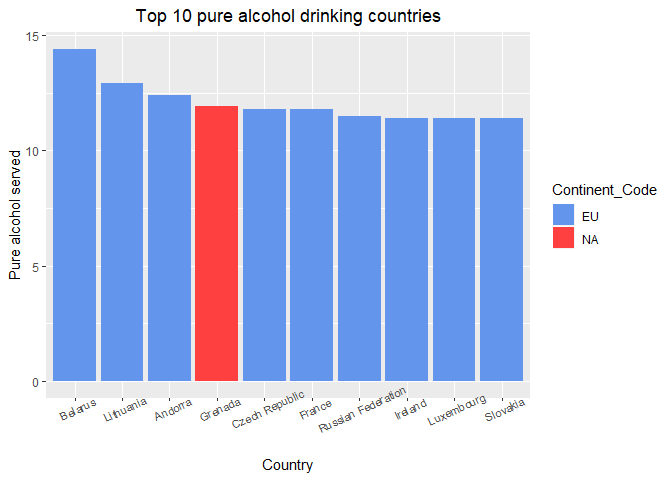
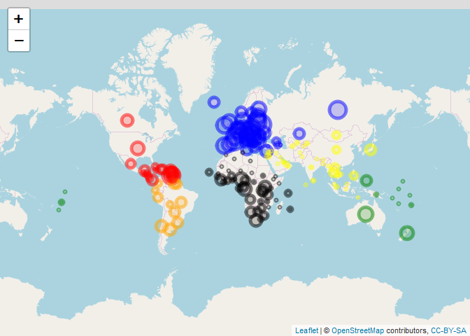

4\. Alcohol Plots
================
Igor
15 03 2020

``` r
library(tidyverse)
```

    ## -- Attaching packages ----------------------------------------------------------------------------------------------------------------- tidyverse 1.3.0 --

    ## <U+221A> ggplot2 3.2.1     <U+221A> purrr   0.3.3
    ## <U+221A> tibble  2.1.3     <U+221A> dplyr   0.8.4
    ## <U+221A> tidyr   1.0.2     <U+221A> stringr 1.4.0
    ## <U+221A> readr   1.3.1     <U+221A> forcats 0.4.0

    ## -- Conflicts -------------------------------------------------------------------------------------------------------------------- tidyverse_conflicts() --
    ## x dplyr::filter() masks stats::filter()
    ## x dplyr::lag()    masks stats::lag()

``` r
library(leaflet)
```

``` r
df <- read_csv('prepared_to_analysis.csv', quoted_na = F)
```

    ## Parsed with column specification:
    ## cols(
    ##   country = col_character(),
    ##   beer_servings = col_double(),
    ##   spirit_servings = col_double(),
    ##   wine_servings = col_double(),
    ##   total_litres_of_pure_alcohol = col_double(),
    ##   Code = col_character(),
    ##   Three_Letter_Country_Code = col_character(),
    ##   Continent_Name = col_character(),
    ##   Continent_Code = col_character(),
    ##   pop_1998 = col_double(),
    ##   pop_2018 = col_double(),
    ##   Population_diff = col_double(),
    ##   gdp_1998 = col_double(),
    ##   gdp_2018 = col_double(),
    ##   GDP_diff = col_double(),
    ##   `sub-region` = col_character(),
    ##   Religion = col_character(),
    ##   latitude = col_double(),
    ##   longitude = col_double()
    ## )

``` r
df %>% glimpse()
```

    ## Observations: 179
    ## Variables: 19
    ## $ country                      <chr> "Afghanistan", "Albania", "Algeria", "...
    ## $ beer_servings                <dbl> 0, 89, 25, 245, 217, 102, 193, 21, 261...
    ## $ spirit_servings              <dbl> 0, 132, 0, 138, 57, 128, 25, 179, 72, ...
    ## $ wine_servings                <dbl> 0, 54, 14, 312, 45, 45, 221, 11, 212, ...
    ## $ total_litres_of_pure_alcohol <dbl> 0.0, 4.9, 0.7, 12.4, 5.9, 4.9, 8.3, 3....
    ## $ Code                         <chr> "AF", "AL", "DZ", "AD", "AO", "AG", "A...
    ## $ Three_Letter_Country_Code    <chr> "AFG", "ALB", "DZA", "AND", "AGO", "AT...
    ## $ Continent_Name               <chr> "Asia", "Europe", "Africa", "Europe", ...
    ## $ Continent_Code               <chr> "AS", "EU", "AF", "EU", "AF", NA, "SA"...
    ## $ pop_1998                     <dbl> 19737765, 3128530, 30192754, 64142, 15...
    ## $ pop_2018                     <dbl> 37172386, 2866376, 42228429, 77006, 30...
    ## $ Population_diff              <dbl> 0.88331283, -0.08379463, 0.39862793, 0...
    ## $ gdp_1998                     <dbl> NA, 2545967253, 48187747529, 121193239...
    ## $ gdp_2018                     <dbl> 1.936297e+10, 1.510250e+10, 1.737580e+...
    ## $ GDP_diff                     <dbl> NA, 4.9319305, 2.6058534, 1.6705647, 1...
    ## $ `sub-region`                 <chr> "Southern Asia", "Southern Europe", "N...
    ## $ Religion                     <chr> "Muslims", "Muslims", "Muslims", "Chri...
    ## $ latitude                     <dbl> 33.939110, 41.153332, 28.033886, 42.54...
    ## $ longitude                    <dbl> 67.709953, 20.168331, 1.659626, 1.6015...

``` r
df %>% summary()
```

    ##    country          beer_servings   spirit_servings  wine_servings   
    ##  Length:179         Min.   :  0.0   Min.   :  0.00   Min.   :  0.00  
    ##  Class :character   1st Qu.: 21.0   1st Qu.:  6.00   1st Qu.:  1.00  
    ##  Mode  :character   Median : 77.0   Median : 61.00   Median :  9.00  
    ##                     Mean   :108.9   Mean   : 82.84   Mean   : 52.35  
    ##                     3rd Qu.:193.0   3rd Qu.:129.50   3rd Qu.: 72.00  
    ##                     Max.   :376.0   Max.   :438.00   Max.   :370.00  
    ##                                                                      
    ##  total_litres_of_pure_alcohol     Code           Three_Letter_Country_Code
    ##  Min.   : 0.000               Length:179         Length:179               
    ##  1st Qu.: 1.300               Class :character   Class :character         
    ##  Median : 4.400               Mode  :character   Mode  :character         
    ##  Mean   : 4.828                                                           
    ##  3rd Qu.: 7.250                                                           
    ##  Max.   :14.400                                                           
    ##                                                                           
    ##  Continent_Name     Continent_Code        pop_1998            pop_2018        
    ##  Length:179         Length:179         Min.   :9.332e+03   Min.   :1.151e+04  
    ##  Class :character   Class :character   1st Qu.:1.324e+06   1st Qu.:1.997e+06  
    ##  Mode  :character   Mode  :character   Median :5.971e+06   Median :8.606e+06  
    ##                                        Mean   :3.140e+07   Mean   :3.983e+07  
    ##                                        3rd Qu.:1.759e+07   3rd Qu.:2.574e+07  
    ##                                        Max.   :1.242e+09   Max.   :1.393e+09  
    ##                                                                               
    ##  Population_diff      gdp_1998            gdp_2018            GDP_diff      
    ##  Min.   :-0.2141   Min.   :1.276e+07   Min.   :4.259e+07   Min.   : 0.2328  
    ##  1st Qu.: 0.1083   1st Qu.:2.055e+09   1st Qu.:9.291e+09   1st Qu.: 1.6718  
    ##  Median : 0.3011   Median :9.012e+09   Median :3.987e+10   Median : 2.6881  
    ##  Mean   : 0.3841   Mean   :1.790e+11   Mean   :4.610e+11   Mean   : 3.6073  
    ##  3rd Qu.: 0.5930   3rd Qu.:5.568e+10   3rd Qu.:2.242e+11   3rd Qu.: 4.3821  
    ##  Max.   : 4.0433   Max.   :9.063e+12   Max.   :2.054e+13   Max.   :35.2364  
    ##                    NA's   :11          NA's   :2           NA's   :12       
    ##   sub-region          Religion            latitude         longitude       
    ##  Length:179         Length:179         Min.   :-40.901   Min.   :-175.198  
    ##  Class :character   Class :character   1st Qu.:  3.561   1st Qu.:  -8.234  
    ##  Mode  :character   Mode  :character   Median : 17.190   Median :  19.699  
    ##                                        Mean   : 18.755   Mean   :  18.860  
    ##                                        3rd Qu.: 40.303   3rd Qu.:  47.529  
    ##                                        Max.   : 64.963   Max.   : 179.414  
    ## 

``` r
df[is.na(df$Code),]['Code'] = 'NA'
df[is.na(df$Continent_Code),]['Continent_Code'] = 'NA'
```

``` r
df$Continent_Code %>% unique()
```

    ## [1] "AS" "EU" "AF" "NA" "SA" "OC"

# Alcohols

## Beers

``` r
df %>% 
  arrange(desc(beer_servings)) %>% 
  head(10) %>% 
  ggplot(aes(x = reorder(country, -beer_servings), y = beer_servings)) + 
  geom_col(aes(fill = Continent_Code), show.legend = T) +
  labs(title = 'Top 10 beer drinking countries', x= 'Country', y = 'Beers served') +
  theme(plot.title = element_text(hjust = .5),
        axis.text.x = element_text(size= 8, angle =25)) +
  scale_fill_manual(values = c('AF'='bisque4', 'EU'='cornflowerblue', 'AS'='gold2', 'NA'='brown1', 'SA'='coral1', 'OC'='aquamarine3'))
```

<!-- -->

I do not know whether Namibia is 1st on purpose or is it some issue with
the data.

``` r
df <- df %>% mutate(color = case_when(Continent_Code == 'AF' ~ "black",
                                Continent_Code == 'EU' ~ "blue",
                                Continent_Code == 'AS' ~ "yellow",
                                Continent_Code == 'NA' ~ "red",
                                Continent_Code == 'SA' ~ "orange",
                                Continent_Code == 'OC' ~ "green"))
```

``` r
leaflet(data = df) %>% 
  addTiles() %>% 
  addCircleMarkers(lat = ~latitude, lng = ~longitude,  color = ~color,radius = ~beer_servings/20)
```

<!-- -->

## Spirits

``` r
df %>% 
  arrange(desc(spirit_servings)) %>% 
  head(10) %>% 
  ggplot(aes(x = reorder(country, -spirit_servings), y = spirit_servings)) + 
  geom_col(aes(fill = Continent_Code), show.legend = T) +
  labs(title = 'Top 10 spirits drinking countries', x= 'Country', y = 'Spirits served') +
  theme(plot.title = element_text(hjust = .5),
        axis.text.x = element_text(size= 8, angle =25)) +
  scale_fill_manual(values = c('AF'='bisque4', 'EU'='cornflowerblue', 'AS'='gold2', 'NA'='brown1', 'SA'='coral1', 'OC'='aquamarine3'))
```

<!-- -->

``` r
leaflet(data = df) %>% 
  addTiles() %>% 
  addCircleMarkers(lat = ~latitude, lng = ~longitude,  color = ~color,radius = ~spirit_servings/20)
```

<!-- -->

## Wine

``` r
df %>% 
  arrange(desc(wine_servings)) %>% 
  head(10) %>% 
  ggplot(aes(x = reorder(country, -wine_servings), y = wine_servings)) + 
  geom_col(aes(fill = Continent_Code), show.legend = T) +
  labs(title = 'Top 10 wine drinking countries', x= 'Country', y = 'Wine served') +
  theme(plot.title = element_text(hjust = .5),
        axis.text.x = element_text(size= 8, angle =25)) +
  scale_fill_manual(values = c('AF'='bisque4', 'EU'='cornflowerblue', 'AS'='gold2', 'NA'='brown1', 'SA'='coral1', 'OC'='aquamarine3'))
```

<!-- -->

Wine is very common drink in Europe.

``` r
leaflet(data = df) %>% 
  addTiles() %>% 
  addCircleMarkers(lat = ~latitude, lng = ~longitude,  color = ~color,radius = ~wine_servings/20)
```

<!-- -->

## Pure alcohol

``` r
df %>% 
  arrange(desc(total_litres_of_pure_alcohol)) %>% 
  head(10) %>% 
  ggplot(aes(x = reorder(country, -total_litres_of_pure_alcohol), y = total_litres_of_pure_alcohol)) + 
  geom_col(aes(fill = Continent_Code), show.legend = T) +
  labs(title = 'Top 10 pure alcohol drinking countries', x= 'Country', y = 'Pure alcohol served') +
  theme(plot.title = element_text(hjust = .5),
        axis.text.x = element_text(size= 8, angle =25)) +
  scale_fill_manual(values = c('AF'='bisque4', 'EU'='cornflowerblue', 'AS'='gold2', 'NA'='brown1', 'SA'='coral1', 'OC'='aquamarine3'))
```

<!-- -->

Similar to wine plot (regarding continents).

``` r
leaflet(data = df) %>% 
  addTiles() %>% 
  addCircleMarkers(lat = ~latitude, lng = ~longitude,  color = ~color,radius = ~total_litres_of_pure_alcohol)
```

<!-- -->
