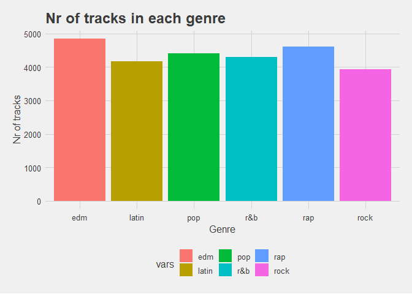
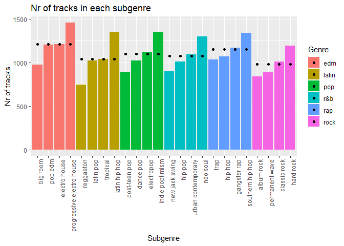
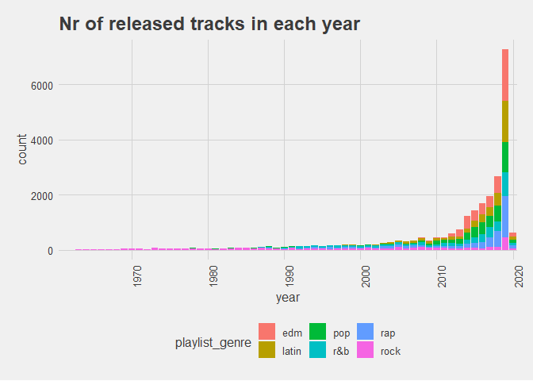
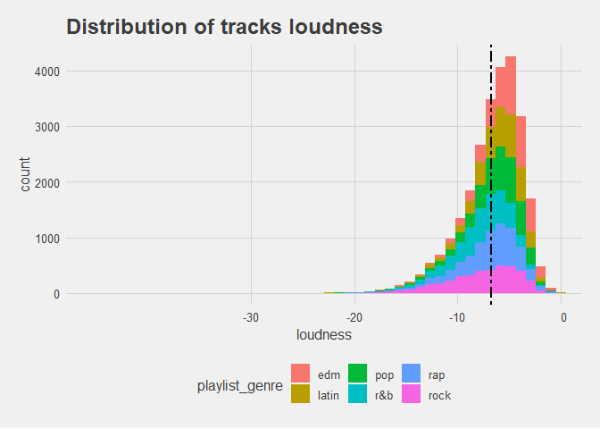
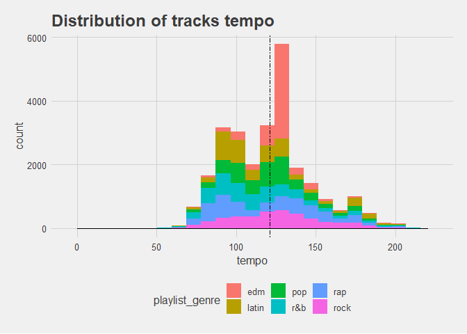

Projekt1\_Bartek
================
Bartosz Adamiec
17 02 2020

``` r
#install.packages("fansi")
library(dplyr)
```

    ## Warning: package 'dplyr' was built under R version 3.6.2

    ## 
    ## Attaching package: 'dplyr'

    ## The following objects are masked from 'package:stats':
    ## 
    ##     filter, lag

    ## The following objects are masked from 'package:base':
    ## 
    ##     intersect, setdiff, setequal, union

``` r
library(lubridate)
```

    ## Warning: package 'lubridate' was built under R version 3.6.2

    ## 
    ## Attaching package: 'lubridate'

    ## The following object is masked from 'package:base':
    ## 
    ##     date

``` r
library(ggplot2)
library(tidyverse)
```

    ## Warning: package 'tidyverse' was built under R version 3.6.2

    ## -- Attaching packages --------------------------------------------------------------------- tidyverse 1.3.0 --

    ## <U+221A> tibble  2.1.3     <U+221A> purrr   0.3.3
    ## <U+221A> tidyr   1.0.0     <U+221A> stringr 1.4.0
    ## <U+221A> readr   1.3.1     <U+221A> forcats 0.4.0

    ## Warning: package 'tidyr' was built under R version 3.6.2

    ## Warning: package 'readr' was built under R version 3.6.2

    ## Warning: package 'purrr' was built under R version 3.6.2

    ## Warning: package 'forcats' was built under R version 3.6.2

    ## -- Conflicts ------------------------------------------------------------------------ tidyverse_conflicts() --
    ## x lubridate::as.difftime() masks base::as.difftime()
    ## x lubridate::date()        masks base::date()
    ## x dplyr::filter()          masks stats::filter()
    ## x lubridate::intersect()   masks base::intersect()
    ## x dplyr::lag()             masks stats::lag()
    ## x lubridate::setdiff()     masks base::setdiff()
    ## x lubridate::union()       masks base::union()

``` r
library(kableExtra)
```

    ## Warning: package 'kableExtra' was built under R version 3.6.2

    ## 
    ## Attaching package: 'kableExtra'

    ## The following object is masked from 'package:dplyr':
    ## 
    ##     group_rows

``` r
library(ggthemes)
```

    ## Warning: package 'ggthemes' was built under R version 3.6.2

``` r
library(corrplot)
```

    ## Warning: package 'corrplot' was built under R version 3.6.2

    ## corrplot 0.84 loaded

``` r
#environment preparation and data load
my_theme <- theme_fivethirtyeight() + theme(axis.title = element_text(), axis.title.x = element_text())

mydata_train <- read.csv("../train_set.csv", stringsAsFactors = FALSE, na.strings="")

mydata_test <- read.csv("../test_set.csv", stringsAsFactors = FALSE, na.strings="")
```

``` r
#removing useless columns(columns with id numbers, not needed in this data analysis)
mydata_train[,c("track_id", "track_album_id", "playlist_id")] <- NULL
```

``` r
#first look at the dataframe
head(mydata_train)
```

    ##       X        track_name       track_artist track_popularity
    ## 1 20378 Baila Baila Baila              Ozuna               65
    ## 2  3549        Last Dance           Covenant                0
    ## 3 28314          Activate       Sandro Silva               31
    ## 4   149   Let Me Love You           DJ Snake               81
    ## 5  1931       Stacy's Mom Fountains Of Wayne               73
    ## 6  5541            6 Kiss       Trippie Redd               83
    ##              track_album_name track_album_release_date
    ## 1           Baila Baila Baila               2019-01-05
    ## 2                  Last Dance               2013-06-07
    ## 3                    Activate               2019-12-04
    ## 4                      Encore               2016-08-05
    ## 5 Welcome Interstate Managers               2003-01-01
    ## 6      A Love Letter To You 4               2019-11-22
    ##                                                               playlist_name
    ## 1                                           Latest Latin American Hits 2020
    ## 2 Gothic / Industrial / Mittelalter / EBM / Futurepop / Gothik / Electropop
    ## 3                                                              Big Room EDM
    ## 4                                                                 Dance Pop
    ## 5                                         Dr. Q's Prescription Playlistđź’Š
    ## 6                                                                 RapCaviar
    ##   playlist_genre playlist_subgenre danceability energy key loudness mode
    ## 1          latin     latin hip hop        0.816  0.754  11   -2.750    0
    ## 2            pop        electropop        0.611  0.988  10   -3.971    1
    ## 3            edm          big room        0.641  0.874   1   -4.991    1
    ## 4            pop         dance pop        0.649  0.716   8   -5.371    1
    ## 5            pop     post-teen pop        0.774  0.750  11   -4.927    0
    ## 6            rap           hip hop        0.687  0.449   2  -10.061    1
    ##   speechiness acousticness instrumentalness liveness valence   tempo
    ## 1      0.1110      0.03610         0.00e+00   0.2170   0.533  99.966
    ## 2      0.1020      0.00254         7.84e-01   0.2220   0.269 136.015
    ## 3      0.0746      0.13600         2.44e-06   0.1990   0.140 127.922
    ## 4      0.0349      0.08630         2.63e-05   0.1350   0.163  99.988
    ## 5      0.0413      0.00210         1.85e-05   0.0808   0.925 118.015
    ## 6      0.1540      0.10900         0.00e+00   0.2820   0.229 142.048
    ##   duration_ms
    ## 1      158400
    ## 2      378120
    ## 3      177187
    ## 4      205947
    ## 5      197987
    ## 6      199437

``` r
#structure of df
str(mydata_train)
```

    ## 'data.frame':    26266 obs. of  21 variables:
    ##  $ X                       : int  20378 3549 28314 149 1931 5541 19225 6366 24863 20862 ...
    ##  $ track_name              : chr  "Baila Baila Baila" "Last Dance" "Activate" "Let Me Love You" ...
    ##  $ track_artist            : chr  "Ozuna" "Covenant" "Sandro Silva" "DJ Snake" ...
    ##  $ track_popularity        : int  65 0 31 81 73 83 73 59 47 51 ...
    ##  $ track_album_name        : chr  "Baila Baila Baila" "Last Dance" "Activate" "Encore" ...
    ##  $ track_album_release_date: chr  "2019-01-05" "2013-06-07" "2019-12-04" "2016-08-05" ...
    ##  $ playlist_name           : chr  "Latest Latin American Hits 2020" "Gothic / Industrial / Mittelalter / EBM / Futurepop / Gothik / Electropop" "Big Room EDM" "Dance Pop" ...
    ##  $ playlist_genre          : chr  "latin" "pop" "edm" "pop" ...
    ##  $ playlist_subgenre       : chr  "latin hip hop" "electropop" "big room" "dance pop" ...
    ##  $ danceability            : num  0.816 0.611 0.641 0.649 0.774 0.687 0.635 0.79 0.594 0.895 ...
    ##  $ energy                  : num  0.754 0.988 0.874 0.716 0.75 0.449 0.713 0.799 0.521 0.43 ...
    ##  $ key                     : int  11 10 1 8 11 2 11 6 0 3 ...
    ##  $ loudness                : num  -2.75 -3.97 -4.99 -5.37 -4.93 ...
    ##  $ mode                    : int  0 1 1 1 0 1 1 1 1 0 ...
    ##  $ speechiness             : num  0.111 0.102 0.0746 0.0349 0.0413 0.154 0.0937 0.15 0.0417 0.143 ...
    ##  $ acousticness            : num  0.0361 0.00254 0.136 0.0863 0.0021 0.109 0.228 0.123 0.161 0.126 ...
    ##  $ instrumentalness        : num  0.00 7.84e-01 2.44e-06 2.63e-05 1.85e-05 0.00 0.00 0.00 5.56e-03 0.00 ...
    ##  $ liveness                : num  0.217 0.222 0.199 0.135 0.0808 0.282 0.0506 0.0575 0.0382 0.0701 ...
    ##  $ valence                 : num  0.533 0.269 0.14 0.163 0.925 0.229 0.749 0.794 0.789 0.793 ...
    ##  $ tempo                   : num  100 136 128 100 118 ...
    ##  $ duration_ms             : int  158400 378120 177187 205947 197987 199437 204701 146400 328240 162034 ...

``` r
#dimensions
dim(mydata_train)
```

    ## [1] 26266    21

``` r
#more info about each collumn
summary(mydata_train)
```

    ##        X          track_name        track_artist       track_popularity
    ##  Min.   :    0   Length:26266       Length:26266       Min.   :  0.00  
    ##  1st Qu.: 8184   Class :character   Class :character   1st Qu.: 24.00  
    ##  Median :16440   Mode  :character   Mode  :character   Median : 45.00  
    ##  Mean   :16421                                         Mean   : 42.39  
    ##  3rd Qu.:24634                                         3rd Qu.: 62.00  
    ##  Max.   :32832                                         Max.   :100.00  
    ##  track_album_name   track_album_release_date playlist_name     
    ##  Length:26266       Length:26266             Length:26266      
    ##  Class :character   Class :character         Class :character  
    ##  Mode  :character   Mode  :character         Mode  :character  
    ##                                                                
    ##                                                                
    ##                                                                
    ##  playlist_genre     playlist_subgenre   danceability        energy      
    ##  Length:26266       Length:26266       Min.   :0.0000   Min.   :0.0118  
    ##  Class :character   Class :character   1st Qu.:0.5630   1st Qu.:0.5800  
    ##  Mode  :character   Mode  :character   Median :0.6720   Median :0.7210  
    ##                                        Mean   :0.6551   Mean   :0.6981  
    ##                                        3rd Qu.:0.7610   3rd Qu.:0.8400  
    ##                                        Max.   :0.9830   Max.   :1.0000  
    ##       key            loudness            mode        speechiness    
    ##  Min.   : 0.000   Min.   :-46.448   Min.   :0.000   Min.   :0.0000  
    ##  1st Qu.: 2.000   1st Qu.: -8.191   1st Qu.:0.000   1st Qu.:0.0410  
    ##  Median : 6.000   Median : -6.164   Median :1.000   Median :0.0625  
    ##  Mean   : 5.395   Mean   : -6.725   Mean   :0.565   Mean   :0.1068  
    ##  3rd Qu.: 9.000   3rd Qu.: -4.644   3rd Qu.:1.000   3rd Qu.:0.1320  
    ##  Max.   :11.000   Max.   :  1.275   Max.   :1.000   Max.   :0.8690  
    ##   acousticness    instrumentalness      liveness         valence      
    ##  Min.   :0.0000   Min.   :0.000000   Min.   :0.0000   Min.   :0.0000  
    ##  1st Qu.:0.0150   1st Qu.:0.000000   1st Qu.:0.0926   1st Qu.:0.3300  
    ##  Median :0.0798   Median :0.000017   Median :0.1270   Median :0.5110  
    ##  Mean   :0.1755   Mean   :0.085842   Mean   :0.1893   Mean   :0.5099  
    ##  3rd Qu.:0.2550   3rd Qu.:0.005020   3rd Qu.:0.2470   3rd Qu.:0.6920  
    ##  Max.   :0.9940   Max.   :0.994000   Max.   :0.9960   Max.   :0.9910  
    ##      tempo         duration_ms    
    ##  Min.   :  0.00   Min.   :  4000  
    ##  1st Qu.: 99.95   1st Qu.:187805  
    ##  Median :121.98   Median :216050  
    ##  Mean   :120.85   Mean   :225836  
    ##  3rd Qu.:133.90   3rd Qu.:253733  
    ##  Max.   :220.25   Max.   :517810

``` r
#checking nr of null values in each collumn
na_count <-sapply(mydata_train, function(y) sum(length(which(is.na(y)))))
na_count <- data.frame(na_count)
na_count
```

    ##                          na_count
    ## X                               0
    ## track_name                      4
    ## track_artist                    4
    ## track_popularity                0
    ## track_album_name                4
    ## track_album_release_date        0
    ## playlist_name                   0
    ## playlist_genre                  0
    ## playlist_subgenre               0
    ## danceability                    0
    ## energy                          0
    ## key                             0
    ## loudness                        0
    ## mode                            0
    ## speechiness                     0
    ## acousticness                    0
    ## instrumentalness                0
    ## liveness                        0
    ## valence                         0
    ## tempo                           0
    ## duration_ms                     0

``` r
#looking at rows with missing track name
mydata_train[is.na(mydata_train$track_name),]
```

    ##           X track_name track_artist track_popularity track_album_name
    ## 150    9283       <NA>         <NA>                0             <NA>
    ## 15546 19811       <NA>         <NA>                0             <NA>
    ## 19676  8151       <NA>         <NA>                0             <NA>
    ## 25781 19568       <NA>         <NA>                0             <NA>
    ##       track_album_release_date         playlist_name playlist_genre
    ## 150                 2017-12-01           GANGSTA Rap            rap
    ## 15546               2012-01-05         latin hip hop          latin
    ## 19676               2012-01-05               HIP&HOP            rap
    ## 25781               2012-01-05 Reggaeton viejito🔥          latin
    ##       playlist_subgenre danceability energy key loudness mode speechiness
    ## 150        gangster rap        0.465  0.820  10   -5.907    0      0.3070
    ## 15546     latin hip hop        0.714  0.821   6   -7.635    1      0.1760
    ## 19676  southern hip hop        0.714  0.821   6   -7.635    1      0.1760
    ## 25781         reggaeton        0.675  0.919  11   -6.075    0      0.0366
    ##       acousticness instrumentalness liveness valence  tempo duration_ms
    ## 150         0.0963          0.00000   0.0888   0.505 86.839      206465
    ## 15546       0.0410          0.00000   0.1160   0.649 95.999      282707
    ## 19676       0.0410          0.00000   0.1160   0.649 95.999      282707
    ## 25781       0.0606          0.00653   0.1030   0.726 97.017      252773

``` r
#as we see all of the missing values are from 4 tracks
```

``` r
#GENRES

#nr of unique genres
length(unique(mydata_train$playlist_genre))
```

    ## [1] 6

``` r
#genre names
unique(mydata_train$playlist_genre)
```

    ## [1] "latin" "pop"   "edm"   "rap"   "r&b"   "rock"

``` r
#how many tracks belong to each genre
genrecount <- count(mydata_train, vars = mydata_train$playlist_genre)
genrecount
```

    ## # A tibble: 6 x 2
    ##   vars      n
    ##   <chr> <int>
    ## 1 edm    4848
    ## 2 latin  4165
    ## 3 pop    4400
    ## 4 r&b    4306
    ## 5 rap    4616
    ## 6 rock   3931

``` r
#plot
genreplot <- ggplot(genrecount) +
  geom_col(aes(x=vars, y=n, fill=vars)) +
  ggtitle("Nr of tracks in each genre") +
  xlab("Genre") +
  ylab("Nr of tracks") +
  my_theme
genreplot
```

<!-- -->

``` r
#SUBGENRES

#extracting genres and subgenres from df
subgenre <- data.frame(table(mydata_train$playlist_genre, mydata_train$playlist_subgenre))
colnames(subgenre) <- c("Genre","Subgenre", "n") 
subgenre <- subgenre[-which(subgenre$n == 0 ), ]

#????
genreMeans <- aggregate(. ~ Genre, subgenre[-2], mean)
for(i in 1:nrow(subgenre)) {
  for(j in 1:nrow(genreMeans)){
    if(subgenre$Genre[i] == genreMeans$Genre[j]) {
      subgenre$Means[i] = genreMeans$n[j]
    }
  }
}

#ordering data by nr of tracks in each subgenre and grouping with genres
subgenre <- subgenre[order(subgenre$n),]
subgenre$Subgenre <- factor(subgenre$Subgenre, levels = subgenre$Subgenre[order(subgenre$Genre)])


ggplot(subgenre, aes(x=Subgenre, y=n, fill=Genre)) +
  geom_bar(stat = "identity") +
  ylab("Nr of tracks") +   
  theme(axis.text.x = element_text(angle = 90, hjust = 1)) +
  ggtitle("Nr of tracks in each subgenre") +
  geom_point(aes(y=Means))
```

<!-- -->

``` r
#chyba nie tak powinnno to wygladac xD
```

``` r
#POPULARITY
popTracks <- mydata_train %>% select(track_name, playlist_genre, playlist_subgenre, track_popularity) %>% group_by(playlist_genre)

#Most popuplar tracks
popTracks[popTracks['track_popularity'] == max(popTracks['track_popularity']),]
```

    ## # A tibble: 2 x 4
    ## # Groups:   playlist_genre [2]
    ##   track_name   playlist_genre playlist_subgenre track_popularity
    ##   <chr>        <chr>          <chr>                        <int>
    ## 1 Dance Monkey latin          latin hip hop                  100
    ## 2 Dance Monkey pop            post-teen pop                  100

``` r
#Popuarity distribution with genres
ggplot(popTracks, aes(track_popularity, fill=playlist_genre)) +
  geom_histogram(bins=50) +
  geom_vline(xintercept = mean(popTracks$track_popularity), size = 1, linetype = 6) +
  my_theme +
  ggtitle("Distribution of track popularities")
```

<!-- -->

``` r
#RELEASE YEAR
relYear <- mydata_train %>% select(playlist_genre, track_album_release_date) %>% group_by(playlist_genre)

#format date to year
relYear$track_album_release_date <- as.Date(relYear$track_album_release_date)
relYear$year <- format(relYear$track_album_release_date, format="%Y")
relYear <- relYear[complete.cases(relYear),]

ggplot(relYear, aes(year, fill=playlist_genre)) +
  geom_histogram(stat="count", binwidth = 50) +
  my_theme +
  theme(axis.text.x = element_text(angle = 90, hjust = 1)) +
  scale_x_discrete(breaks = c("1970", "1980", "1990", "2000", "2010", "2020")) +
  ggtitle("Nr of released tracks in each year")
```

    ## Warning: Ignoring unknown parameters: binwidth, bins, pad

<!-- -->

``` r
#DANCEABILITY
dancea <- mydata_train %>% select(playlist_genre, track_name, track_artist, danceability) %>% group_by(playlist_genre)
#most danceable track
dancea[dancea$danceability == max(dancea$danceability),]
```

    ## # A tibble: 1 x 4
    ## # Groups:   playlist_genre [1]
    ##   playlist_genre track_name                   track_artist     danceability
    ##   <chr>          <chr>                        <chr>                   <dbl>
    ## 1 edm            If Only I Could (feat. Stev~ Fusion Groove O~        0.983

``` r
ggplot(dancea, aes(danceability, fill=playlist_genre)) +
  geom_histogram(bins=50) +
  geom_vline(xintercept = mean(dancea$danceability), size = 1, linetype = 6) +
  my_theme +
  ggtitle("Distribution of tracks danceability")
```

<!-- -->

``` r
#ENERGY
energy <- mydata_train %>% select(playlist_genre, track_name, track_artist, energy) %>% group_by(playlist_genre)
#most energetic tracks
energy[energy$energy == max(energy$energy),]
```

    ## # A tibble: 2 x 4
    ## # Groups:   playlist_genre [1]
    ##   playlist_genre track_name                    track_artist          energy
    ##   <chr>          <chr>                         <chr>                  <dbl>
    ## 1 latin          Rain Forest and Tropical Bea~ Nature Sounds Nature~      1
    ## 2 latin          Chill Waves & Wind in Leaves  Pinetree Way               1

``` r
ggplot(energy, aes(energy, fill=playlist_genre)) +
  geom_histogram(bins=50) +
  geom_vline(xintercept = mean(energy$energy), size = 1, linetype = 6) +
  my_theme +
  ggtitle("Distribution of tracks energy")
```

<!-- -->

``` r
#KEYS
keys <- mydata_train %>% select(playlist_genre, track_name, track_artist, key) %>% group_by(playlist_genre)

ggplot(keys, aes(key, fill=playlist_genre)) +
  geom_histogram(bins=50) +
  my_theme +
  ggtitle("Distribution of tracks keys") +
  facet_wrap(~ playlist_genre)
```

<!-- -->

``` r
#MODE
mode <- mydata_train %>% select(playlist_genre, track_name, track_artist, mode) %>% group_by(playlist_genre)

ggplot(mode, aes(mode, fill=playlist_genre)) +
  geom_bar() +
  my_theme +
  ggtitle("Does track use mode?(N|Y)") +
  scale_x_discrete(breaks = c(0, 1)) +
  facet_wrap(~ playlist_genre) 
```

<!-- -->

``` r
#LOUDNESS
loud <- mydata_train %>% select(playlist_genre, track_name, track_artist, loudness) %>% group_by(playlist_genre)
#loudest/most quiet tracks
loud[loud$loudness == max(loud$loudness),]
```

    ## # A tibble: 1 x 4
    ## # Groups:   playlist_genre [1]
    ##   playlist_genre track_name               track_artist loudness
    ##   <chr>          <chr>                    <chr>           <dbl>
    ## 1 rock           Raw Power - Iggy Pop Mix The Stooges      1.27

``` r
loud[loud$loudness == min(loud$loudness),]
```

    ## # A tibble: 1 x 4
    ## # Groups:   playlist_genre [1]
    ##   playlist_genre track_name      track_artist         loudness
    ##   <chr>          <chr>           <chr>                   <dbl>
    ## 1 latin          Peaceful Forest The Sleep Specialist    -46.4

``` r
ggplot(loud, aes(loudness, fill=playlist_genre)) +
  geom_histogram(bins=50) +
  geom_vline(xintercept = mean(loud$loudness), size = 1, linetype = 6) +
  my_theme +
  scale_x_discrete(limits = c(-30, -20, -10, 0, 5)) +
  ggtitle("Distribution of tracks loudness")
```

<!-- -->

``` r
#SPEECHINESS
speech <- mydata_train %>% select(playlist_genre, track_name, track_artist, speechiness) %>% group_by(playlist_genre)

speech[speech$speechiness == max(speech$speechiness),]
```

    ## # A tibble: 1 x 4
    ## # Groups:   playlist_genre [1]
    ##   playlist_genre track_name                   track_artist speechiness
    ##   <chr>          <chr>                        <chr>              <dbl>
    ## 1 r&b            Warm Water - Snakehips Remix BANKS              0.869

``` r
ggplot(speech, aes(speechiness, fill=playlist_genre)) +
  geom_histogram(bins=50) +
  geom_vline(xintercept = mean(speech$speechiness), size = 1, linetype = 6) +
  my_theme +
  ggtitle("Distribution of tracks speechiness") +
  facet_wrap(~ playlist_genre) 
```

<!-- -->

``` r
#ACOUSTICNESS
acc <- mydata_train %>% select(playlist_genre, track_name, track_artist, acousticness) %>% group_by(playlist_genre)

acc[acc$acousticness == max(acc$acousticness),]
```

    ## # A tibble: 1 x 4
    ## # Groups:   playlist_genre [1]
    ##   playlist_genre track_name           track_artist             acousticness
    ##   <chr>          <chr>                <chr>                           <dbl>
    ## 1 rap            I'm Going to Live M~ DJ Screw & The Screwed ~        0.994

``` r
ggplot(acc, aes(acousticness, fill=playlist_genre)) +
  geom_histogram(bins=50) +
  geom_vline(xintercept = mean(acc$acousticness), size = 1, linetype = 6) +
  my_theme +
  ggtitle("Distribution of tracks acousticness") +
  facet_wrap(~ playlist_genre) 
```

<!-- -->

``` r
#INSTRUMENTALNESS
ins <- mydata_train %>% select(playlist_genre, track_name, track_artist, instrumentalness) %>% group_by(playlist_genre)

ins[ins$instrumentalness == max(ins$instrumentalness),]
```

    ## # A tibble: 1 x 4
    ## # Groups:   playlist_genre [1]
    ##   playlist_genre track_name                   track_artist instrumentalness
    ##   <chr>          <chr>                        <chr>                   <dbl>
    ## 1 latin          Chill Waves & Wind in Leaves Pinetree Way            0.994

``` r
ggplot(ins, aes(instrumentalness, fill=playlist_genre)) +
  geom_histogram(bins=50) +
  geom_vline(xintercept = mean(ins$instrumentalness), size = 1, linetype = 6) +
  my_theme +
  ggtitle("Distribution of tracks instrumentalness") +
  facet_wrap(~ playlist_genre) +
  scale_x_log10()
```

    ## Warning: Transformation introduced infinite values in continuous x-axis

    ## Warning: Removed 9590 rows containing non-finite values (stat_bin).

<!-- -->

``` r
#LIVENESS
live <- mydata_train %>% select(playlist_genre, track_name, track_artist, liveness) %>% group_by(playlist_genre)

live[live$liveness == max(live$liveness),]
```

    ## # A tibble: 1 x 4
    ## # Groups:   playlist_genre [1]
    ##   playlist_genre track_name                           track_artist liveness
    ##   <chr>          <chr>                                <chr>           <dbl>
    ## 1 rock           Knockin' On Heaven's Door - Live In~ Guns N' Ros~    0.996

``` r
ggplot(live, aes(liveness, fill=playlist_genre)) +
  geom_histogram(bins=50) +
  geom_vline(xintercept = mean(live$liveness), size = 1, linetype = 6) +
  my_theme +
  ggtitle("Distribution of tracks liveness") +
  facet_wrap(~ playlist_genre) 
```

<!-- -->

``` r
#kradzione od Pawła żeby zobaczyć jak wygląda
ggplot(live, aes(liveness)) +
  geom_histogram(bins = 50, aes(y = ..density..), fill = "red") +  
  geom_density(alpha = 0.002, fill = "black") + 
  my_theme  + ggtitle("Distribution of liveness") +
  geom_vline(xintercept = round(mean(live$liveness), 2), size = 1, linetype = 2) +
  facet_wrap(~ playlist_genre) +scale_x_log10()
```

    ## Warning: Transformation introduced infinite values in continuous x-axis
    
    ## Warning: Transformation introduced infinite values in continuous x-axis

    ## Warning: Removed 1 rows containing non-finite values (stat_bin).

    ## Warning: Removed 1 rows containing non-finite values (stat_density).

<!-- -->

``` r
#VALENCE
vlc <- mydata_train %>% select(playlist_genre, track_name, track_artist, valence) %>% group_by(playlist_genre)

vlc[vlc$valence == max(vlc$valence),]
```

    ## # A tibble: 1 x 4
    ## # Groups:   playlist_genre [1]
    ##   playlist_genre track_name track_artist valence
    ##   <chr>          <chr>      <chr>          <dbl>
    ## 1 rock           Low Rider  War            0.991

``` r
ggplot(vlc, aes(valence, fill=playlist_genre)) +
  geom_histogram(bins=50) +
  geom_vline(xintercept = mean(vlc$valence), size = 1, linetype = 6) +
  my_theme +
  ggtitle("Distribution of tracks valence") +
  facet_wrap(~ playlist_genre) 
```

<!-- -->

``` r
#TEMPO
temp <- mydata_train %>% select(playlist_genre, track_name, track_artist, tempo) %>% group_by(playlist_genre)

temp[temp$tempo == max(temp$tempo),]
```

    ## # A tibble: 1 x 4
    ## # Groups:   playlist_genre [1]
    ##   playlist_genre track_name     track_artist       tempo
    ##   <chr>          <chr>          <chr>              <dbl>
    ## 1 latin          It's Only Time Cabela and Schmitt  220.

``` r
ggplot(temp, aes(tempo, fill=playlist_genre)) +
  geom_histogram(bins=50, aes(y = ..density..)) +
  geom_density(alpha = 0.002, fill = "black") +
  geom_vline(xintercept = mean(temp$tempo), size = .1, linetype = 6) +
  my_theme +
  ggtitle("Distribution of tracks tempo") +
  facet_wrap(~ playlist_genre) 
```

<!-- -->

``` r
#DURATION
dur <- mydata_train %>% select(playlist_genre, track_name, track_artist, duration_ms) %>% group_by(playlist_genre)

dur[dur$duration_ms == max(dur$duration_ms),]
```

    ## # A tibble: 1 x 4
    ## # Groups:   playlist_genre [1]
    ##   playlist_genre track_name track_artist duration_ms
    ##   <chr>          <chr>      <chr>              <int>
    ## 1 latin          47 - Remix Anuel AA          517810

``` r
ggplot(dur, aes(duration_ms, fill=playlist_genre)) +
  geom_histogram(bins=50) +
  geom_vline(xintercept = mean(dur$duration_ms), size = .1, linetype = 6) +
  my_theme +
  theme(axis.text.x = element_text(angle = 90, hjust = 1)) +
  ggtitle("Distribution of tracks duration") +
  facet_wrap(~ playlist_genre) 
```

<!-- -->
