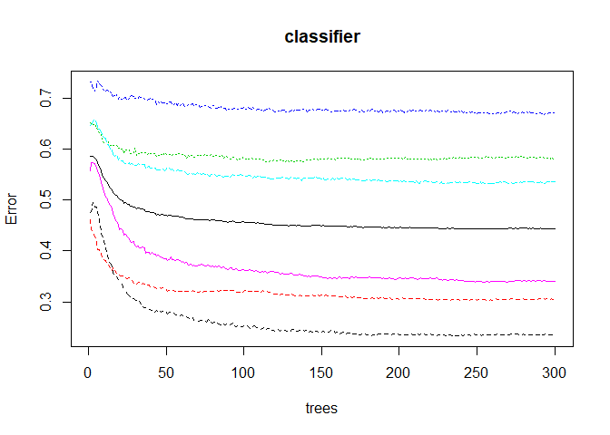

Projekt2\_Bartek
================
Bartosz Adamiec
17 02 2020

``` r
# Random Forest 

#environment preparation and data load
my_theme <- theme_fivethirtyeight() + theme(axis.title = element_text(), axis.title.x = element_text())

mydata_train <- read.csv("../train_set.csv", stringsAsFactors = FALSE, na.strings="")

mydata_test <- read.csv("../test_set.csv", stringsAsFactors = FALSE, na.strings="")

lf_train <- mydata_train %>% select(playlist_genre, track_popularity, danceability, energy, key, loudness, mode, speechiness, acousticness, instrumentalness, liveness, valence, tempo, duration_ms)

lf_test <- mydata_test %>% select(playlist_genre, track_popularity, danceability, energy, key, loudness, mode, speechiness, acousticness, instrumentalness, liveness, valence, tempo, duration_ms)


lf_train <- lf_train %>% mutate_if(is.character,as.factor)
lf_test <- lf_test %>% mutate_if(is.character,as.factor)


lf_train$duration_ms <- scale(lf_train$duration_ms)
lf_test$duration_ms <- scale(lf_test$duration_ms)

str(lf_train)
```

    ## 'data.frame':    26266 obs. of  14 variables:
    ##  $ playlist_genre  : Factor w/ 6 levels "edm","latin",..: 2 3 1 3 3 5 2 5 4 2 ...
    ##  $ track_popularity: int  65 0 31 81 73 83 73 59 47 51 ...
    ##  $ danceability    : num  0.816 0.611 0.641 0.649 0.774 0.687 0.635 0.79 0.594 0.895 ...
    ##  $ energy          : num  0.754 0.988 0.874 0.716 0.75 0.449 0.713 0.799 0.521 0.43 ...
    ##  $ key             : int  11 10 1 8 11 2 11 6 0 3 ...
    ##  $ loudness        : num  -2.75 -3.97 -4.99 -5.37 -4.93 ...
    ##  $ mode            : int  0 1 1 1 0 1 1 1 1 0 ...
    ##  $ speechiness     : num  0.111 0.102 0.0746 0.0349 0.0413 0.154 0.0937 0.15 0.0417 0.143 ...
    ##  $ acousticness    : num  0.0361 0.00254 0.136 0.0863 0.0021 0.109 0.228 0.123 0.161 0.126 ...
    ##  $ instrumentalness: num  0.00 7.84e-01 2.44e-06 2.63e-05 1.85e-05 0.00 0.00 0.00 5.56e-03 0.00 ...
    ##  $ liveness        : num  0.217 0.222 0.199 0.135 0.0808 0.282 0.0506 0.0575 0.0382 0.0701 ...
    ##  $ valence         : num  0.533 0.269 0.14 0.163 0.925 0.229 0.749 0.794 0.789 0.793 ...
    ##  $ tempo           : num  100 136 128 100 118 ...
    ##  $ duration_ms     : num [1:26266, 1] -1.126 2.542 -0.812 -0.332 -0.465 ...
    ##   ..- attr(*, "scaled:center")= num 225836
    ##   ..- attr(*, "scaled:scale")= num 59897

``` r
# Fitting Random Forest Classification to the Training set
#install.packages('randomForest')
#removing as those collumns are not really important
lf_train$key <- NULL
lf_test$key <- NULL
lf_train$mode <- NULL
lf_test$mode <- NULL

library(randomForest)
```

    ## Warning: package 'randomForest' was built under R version 3.6.2

    ## randomForest 4.6-14

    ## Type rfNews() to see new features/changes/bug fixes.

    ## 
    ## Attaching package: 'randomForest'

    ## The following object is masked from 'package:ggplot2':
    ## 
    ##     margin

    ## The following object is masked from 'package:dplyr':
    ## 
    ##     combine

``` r
set.seed(123)
classifier = randomForest(x = lf_train[-1],
                          y = lf_train$playlist_genre,
                          ntree = 300)

# Predicting the Test set results
y_pred = predict(classifier, newdata = lf_test[-1])
```

``` r
# Making the Confusion Matrix
xtab <- table(y_pred, lf_test[, 1])
library(caret) 
```

    ## Warning: package 'caret' was built under R version 3.6.2

    ## Loading required package: lattice

    ## 
    ## Attaching package: 'caret'

    ## The following object is masked from 'package:purrr':
    ## 
    ##     lift

``` r
confusionMatrix(xtab)
```

    ## Confusion Matrix and Statistics
    ## 
    ##        
    ## y_pred  edm latin pop r&b rap rock
    ##   edm   811    86 185  41  62   33
    ##   latin  86   466 152 102  92   21
    ##   pop   153   138 366 151  67   83
    ##   r&b    40   112 158 527 128   71
    ##   rap    58   152  88 214 753   17
    ##   rock   47    36 158  90  28  795
    ## 
    ## Overall Statistics
    ##                                           
    ##                Accuracy : 0.5662          
    ##                  95% CI : (0.5541, 0.5782)
    ##     No Information Rate : 0.182           
    ##     P-Value [Acc > NIR] : < 2.2e-16       
    ##                                           
    ##                   Kappa : 0.479           
    ##                                           
    ##  Mcnemar's Test P-Value : 1.385e-10       
    ## 
    ## Statistics by Class:
    ## 
    ##                      Class: edm Class: latin Class: pop Class: r&b
    ## Sensitivity              0.6787      0.47071    0.33062    0.46844
    ## Specificity              0.9242      0.91877    0.89158    0.90647
    ## Pos Pred Value           0.6658      0.50707    0.38205    0.50869
    ## Neg Pred Value           0.9282      0.90722    0.86789    0.89188
    ## Prevalence               0.1820      0.15075    0.16857    0.17131
    ## Detection Rate           0.1235      0.07096    0.05573    0.08025
    ## Detection Prevalence     0.1855      0.13994    0.14588    0.15776
    ## Balanced Accuracy        0.8014      0.69474    0.61110    0.68746
    ##                      Class: rap Class: rock
    ## Sensitivity              0.6664      0.7794
    ## Specificity              0.9027      0.9353
    ## Pos Pred Value           0.5874      0.6889
    ## Neg Pred Value           0.9287      0.9584
    ## Prevalence               0.1721      0.1553
    ## Detection Rate           0.1147      0.1211
    ## Detection Prevalence     0.1952      0.1757
    ## Balanced Accuracy        0.7845      0.8573

``` r
#checking importance of each collumn
importance(classifier)
```

    ##                  MeanDecreaseGini
    ## track_popularity         1491.286
    ## danceability             2306.013
    ## energy                   1928.520
    ## loudness                 1736.651
    ## speechiness              2384.084
    ## acousticness             1835.705
    ## instrumentalness         1539.101
    ## liveness                 1334.989
    ## valence                  1849.068
    ## tempo                    2518.581
    ## duration_ms              1825.987

``` r
plot(classifier)
```

<!-- -->

``` r
#getTree(classifier, k=1, labelVar=TRUE)
# library(ggplot2)
# pGenres <- predict(classifier,lf_test,'vote')
# plotData <- lapply(names(lf_test[,-1]), function(x){
#   out <- data.frame(
#     var = x,
#     type = c(rep('Actual',nrow(lf_test)),rep('Predicted',nrow(lf_test))),
#     value = c(lf_test[,x],lf_test[,x]),
#     genres = c(as.numeric(lf_test$playlist_genre)-1,pGenres)
#     )
#   out$value <- out$value-min(out$value) #Normalize to [0,1]
#   out$value <- out$value/max(out$value)
#   out
# })
# plotData <- do.call(rbind,plotData)
# qplot(value, genres, data=plotData, facets = type ~ var, geom='smooth', span = 0.5)
```

``` r
#Random forest without outliers

out_dance <-boxplot(lf_train$danceability, plot=FALSE)$out
#out_popu <- boxplot(lf_train$track_popularity, plot=FALSE)$out
out_energy <- boxplot(lf_train$energy, plot=FALSE)$out
#out_key <- boxplot(lf_train$key, plot=FALSE)$out
out_loud <- boxplot(lf_train$loudness, plot=FALSE)$out
out_speech <- boxplot(lf_train$speechiness, plot=FALSE)$out
out_acoustic <- boxplot(lf_train$acousticness, plot=FALSE)$out
out_instrumental <- boxplot(lf_train$instrumentalness, plot=FALSE)$out
out_live <- boxplot(lf_train$liveness, plot=FALSE)$out
#out_valence <- boxplot(lf_train$valence, plot=FALSE)$out
out_tempo <- boxplot(lf_train$tempo, plot=FALSE)$out
out_duration <- boxplot(lf_train$duration_ms, plot=F)$out

#removed inserts where there was no outliers


outliers_help <- lf_train

outliers_help <- outliers_help[-which(outliers_help$danceability %in% out_dance),]
outliers_help <- outliers_help[-which(outliers_help$energy %in% out_energy),]
##outliers_help <- outliers_help[-which(outliers_help$loudness %in% out_loud),]
outliers_help <- outliers_help[-which(outliers_help$speechiness %in% out_speech),]
outliers_help <- outliers_help[-which(outliers_help$acousticness %in% out_acoustic),]
##outliers_help <- outliers_help[-which(outliers_help$instrumentalness %in% out_instrumental),]
outliers_help <- outliers_help[-which(outliers_help$liveness %in% out_live),]
outliers_help <- outliers_help[-which(outliers_help$tempo %in% out_tempo),]
outliers_help <- outliers_help[-which(outliers_help$duration_ms %in% out_duration),]
```

``` r
library(randomForest)
set.seed(123)
classifier2 = randomForest(x = outliers_help[-1],
                          y = outliers_help$playlist_genre,
                          ntree = 500)

# Predicting the Test set results
y_pred2 = predict(classifier2, newdata = lf_test[-1])
```

``` r
# Making the Confusion Matrix
xtab2 <- table(y_pred2, lf_test[,1])
library(caret) 
confusionMatrix(xtab2)
```

    ## Confusion Matrix and Statistics
    ## 
    ##        
    ## y_pred2 edm latin pop r&b rap rock
    ##   edm   813    83 172  40  72   29
    ##   latin  71   421 140  86  95   23
    ##   pop   169   172 387 169  67   97
    ##   r&b    45   115 137 505 144   65
    ##   rap    56   157  95 207 718   10
    ##   rock   41    42 176 118  34  796
    ## 
    ## Overall Statistics
    ##                                           
    ##                Accuracy : 0.5543          
    ##                  95% CI : (0.5422, 0.5664)
    ##     No Information Rate : 0.182           
    ##     P-Value [Acc > NIR] : < 2.2e-16       
    ##                                           
    ##                   Kappa : 0.4647          
    ##                                           
    ##  Mcnemar's Test P-Value : 1.916e-15       
    ## 
    ## Statistics by Class:
    ## 
    ##                      Class: edm Class: latin Class: pop Class: r&b
    ## Sensitivity              0.6803      0.42525    0.34959     0.4489
    ## Specificity              0.9263      0.92559    0.87656     0.9070
    ## Pos Pred Value           0.6725      0.50359    0.36475     0.4995
    ## Neg Pred Value           0.9287      0.90072    0.86923     0.8884
    ## Prevalence               0.1820      0.15075    0.16857     0.1713
    ## Detection Rate           0.1238      0.06411    0.05893     0.0769
    ## Detection Prevalence     0.1841      0.12730    0.16157     0.1540
    ## Balanced Accuracy        0.8033      0.67542    0.61308     0.6780
    ##                      Class: rap Class: rock
    ## Sensitivity              0.6354      0.7804
    ## Specificity              0.9034      0.9259
    ## Pos Pred Value           0.5776      0.6595
    ## Neg Pred Value           0.9226      0.9582
    ## Prevalence               0.1721      0.1553
    ## Detection Rate           0.1093      0.1212
    ## Detection Prevalence     0.1893      0.1838
    ## Balanced Accuracy        0.7694      0.8531
