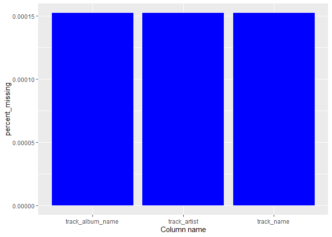
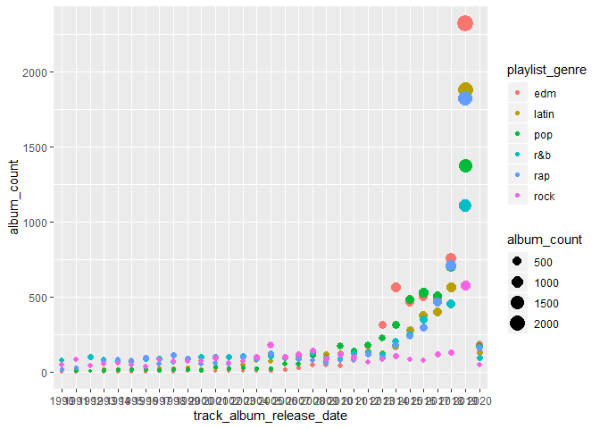
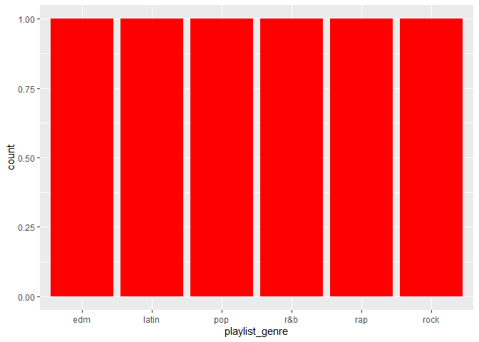
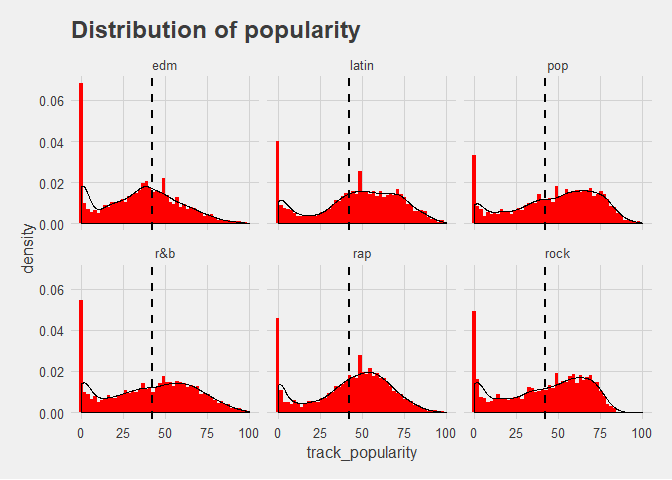
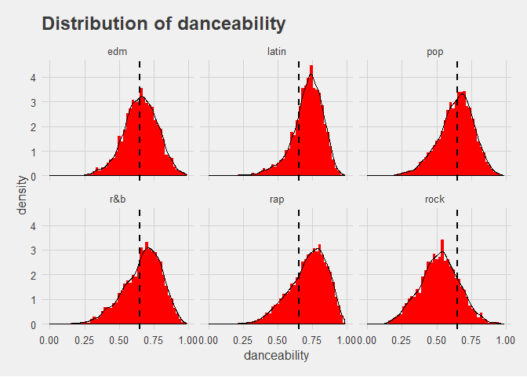
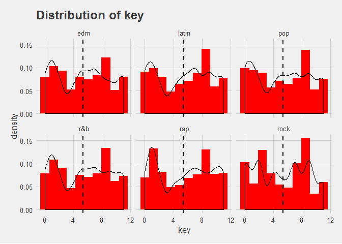

Przyklad RMarkdown
================
Igor
14 02 2020

``` r
library(lubridate)
```

    ## 
    ## Attaching package: 'lubridate'

    ## The following object is masked from 'package:base':
    ## 
    ##     date

``` r
library(tidyverse)
```

    ## -- Attaching packages -------------------------------------------------------------------------------------------------------------------------- tidyverse 1.3.0 --

    ## <U+221A> ggplot2 3.2.1     <U+221A> purrr   0.3.3
    ## <U+221A> tibble  2.1.3     <U+221A> dplyr   0.8.4
    ## <U+221A> tidyr   1.0.2     <U+221A> stringr 1.4.0
    ## <U+221A> readr   1.3.1     <U+221A> forcats 0.4.0

    ## -- Conflicts ----------------------------------------------------------------------------------------------------------------------------- tidyverse_conflicts() --
    ## x lubridate::as.difftime() masks base::as.difftime()
    ## x lubridate::date()        masks base::date()
    ## x dplyr::filter()          masks stats::filter()
    ## x lubridate::intersect()   masks base::intersect()
    ## x dplyr::lag()             masks stats::lag()
    ## x lubridate::setdiff()     masks base::setdiff()
    ## x lubridate::union()       masks base::union()

``` r
library(kableExtra)
```

    ## 
    ## Attaching package: 'kableExtra'

    ## The following object is masked from 'package:dplyr':
    ## 
    ##     group_rows

``` r
library(ggthemes)
```

create global theme to use later

``` r
my_theme <- theme_fivethirtyeight() + theme(axis.title = element_text(), axis.title.x = element_text())

mydata_train <- read.csv("../train_set.csv", stringsAsFactors = FALSE, na.strings="")

mydata_test <- read.csv("../test_set.csv", stringsAsFactors = FALSE, na.strings="")
```

union obu zbiorow

``` r
mydata <- bind_rows(mydata_train, mydata_test)
```

``` r
str(mydata)
```

    ## 'data.frame':    32833 obs. of  24 variables:
    ##  $ X                       : int  20378 3549 28314 149 1931 5541 19225 6366 24863 20862 ...
    ##  $ track_id                : chr  "7uH27oIt4a6cIFCA8ZPcyG" "6GunRGvhXUyvREwRnnKbDC" "4IyVra117kbefOwCEkKPb2" "0lYBSQXN6rCTvUZvg9S0lU" ...
    ##  $ track_name              : chr  "Baila Baila Baila" "Last Dance" "Activate" "Let Me Love You" ...
    ##  $ track_artist            : chr  "Ozuna" "Covenant" "Sandro Silva" "DJ Snake" ...
    ##  $ track_popularity        : int  65 0 31 81 73 83 73 59 47 51 ...
    ##  $ track_album_id          : chr  "6xQurnsfSvF3hQwU5EIqB8" "0UHnC3KThaYwuDoDh4HRzB" "21l4YlhJ5FYFvGDeaW9jrZ" "02sEJTj1sye1JaqxqpcSCp" ...
    ##  $ track_album_name        : chr  "Baila Baila Baila" "Last Dance" "Activate" "Encore" ...
    ##  $ track_album_release_date: chr  "2019-01-05" "2013-06-07" "2019-12-04" "2016-08-05" ...
    ##  $ playlist_name           : chr  "Latest Latin American Hits 2020" "Gothic / Industrial / Mittelalter / EBM / Futurepop / Gothik / Electropop" "Big Room EDM" "Dance Pop" ...
    ##  $ playlist_id             : chr  "51LvliKED7oZNJR8XCiPip" "53CmFroG6MWR5reOOXJX6B" "3S03NWbWkrR1e7DPH9rf9Z" "37i9dQZF1DWZQaaqNMbbXa" ...
    ##  $ playlist_genre          : chr  "latin" "pop" "edm" "pop" ...
    ##  $ playlist_subgenre       : chr  "latin hip hop" "electropop" "big room" "dance pop" ...
    ##  $ danceability            : num  0.816 0.611 0.641 0.649 0.774 0.687 0.635 0.79 0.594 0.895 ...
    ##  $ energy                  : num  0.754 0.988 0.874 0.716 0.75 0.449 0.713 0.799 0.521 0.43 ...
    ##  $ key                     : int  11 10 1 8 11 2 11 6 0 3 ...
    ##  $ loudness                : num  -2.75 -3.97 -4.99 -5.37 -4.93 ...
    ##  $ mode                    : int  0 1 1 1 0 1 1 1 1 0 ...
    ##  $ speechiness             : num  0.111 0.102 0.0746 0.0349 0.0413 0.154 0.0937 0.15 0.0417 0.143 ...
    ##  $ acousticness            : num  0.0361 0.00254 0.136 0.0863 0.0021 0.109 0.228 0.123 0.161 0.126 ...
    ##  $ instrumentalness        : num  0.00 7.84e-01 2.44e-06 2.63e-05 1.85e-05 0.00 0.00 0.00 5.56e-03 0.00 ...
    ##  $ liveness                : num  0.217 0.222 0.199 0.135 0.0808 0.282 0.0506 0.0575 0.0382 0.0701 ...
    ##  $ valence                 : num  0.533 0.269 0.14 0.163 0.925 0.229 0.749 0.794 0.789 0.793 ...
    ##  $ tempo                   : num  100 136 128 100 118 ...
    ##  $ duration_ms             : int  158400 378120 177187 205947 197987 199437 204701 146400 328240 162034 ...

``` r
head(mydata, n = 20) %>% kable() %>% kable_styling()
```

<table class="table" style="margin-left: auto; margin-right: auto;">

<thead>

<tr>

<th style="text-align:right;">

X

</th>

<th style="text-align:left;">

track\_id

</th>

<th style="text-align:left;">

track\_name

</th>

<th style="text-align:left;">

track\_artist

</th>

<th style="text-align:right;">

track\_popularity

</th>

<th style="text-align:left;">

track\_album\_id

</th>

<th style="text-align:left;">

track\_album\_name

</th>

<th style="text-align:left;">

track\_album\_release\_date

</th>

<th style="text-align:left;">

playlist\_name

</th>

<th style="text-align:left;">

playlist\_id

</th>

<th style="text-align:left;">

playlist\_genre

</th>

<th style="text-align:left;">

playlist\_subgenre

</th>

<th style="text-align:right;">

danceability

</th>

<th style="text-align:right;">

energy

</th>

<th style="text-align:right;">

key

</th>

<th style="text-align:right;">

loudness

</th>

<th style="text-align:right;">

mode

</th>

<th style="text-align:right;">

speechiness

</th>

<th style="text-align:right;">

acousticness

</th>

<th style="text-align:right;">

instrumentalness

</th>

<th style="text-align:right;">

liveness

</th>

<th style="text-align:right;">

valence

</th>

<th style="text-align:right;">

tempo

</th>

<th style="text-align:right;">

duration\_ms

</th>

</tr>

</thead>

<tbody>

<tr>

<td style="text-align:right;">

20378

</td>

<td style="text-align:left;">

7uH27oIt4a6cIFCA8ZPcyG

</td>

<td style="text-align:left;">

Baila Baila Baila

</td>

<td style="text-align:left;">

Ozuna

</td>

<td style="text-align:right;">

65

</td>

<td style="text-align:left;">

6xQurnsfSvF3hQwU5EIqB8

</td>

<td style="text-align:left;">

Baila Baila Baila

</td>

<td style="text-align:left;">

2019-01-05

</td>

<td style="text-align:left;">

Latest Latin American Hits 2020

</td>

<td style="text-align:left;">

51LvliKED7oZNJR8XCiPip

</td>

<td style="text-align:left;">

latin

</td>

<td style="text-align:left;">

latin hip hop

</td>

<td style="text-align:right;">

0.816

</td>

<td style="text-align:right;">

0.754

</td>

<td style="text-align:right;">

11

</td>

<td style="text-align:right;">

\-2.750

</td>

<td style="text-align:right;">

0

</td>

<td style="text-align:right;">

0.1110

</td>

<td style="text-align:right;">

0.036100

</td>

<td style="text-align:right;">

0.00e+00

</td>

<td style="text-align:right;">

0.2170

</td>

<td style="text-align:right;">

0.533

</td>

<td style="text-align:right;">

99.966

</td>

<td style="text-align:right;">

158400

</td>

</tr>

<tr>

<td style="text-align:right;">

3549

</td>

<td style="text-align:left;">

6GunRGvhXUyvREwRnnKbDC

</td>

<td style="text-align:left;">

Last Dance

</td>

<td style="text-align:left;">

Covenant

</td>

<td style="text-align:right;">

0

</td>

<td style="text-align:left;">

0UHnC3KThaYwuDoDh4HRzB

</td>

<td style="text-align:left;">

Last Dance

</td>

<td style="text-align:left;">

2013-06-07

</td>

<td style="text-align:left;">

Gothic / Industrial / Mittelalter / EBM / Futurepop / Gothik /
Electropop

</td>

<td style="text-align:left;">

53CmFroG6MWR5reOOXJX6B

</td>

<td style="text-align:left;">

pop

</td>

<td style="text-align:left;">

electropop

</td>

<td style="text-align:right;">

0.611

</td>

<td style="text-align:right;">

0.988

</td>

<td style="text-align:right;">

10

</td>

<td style="text-align:right;">

\-3.971

</td>

<td style="text-align:right;">

1

</td>

<td style="text-align:right;">

0.1020

</td>

<td style="text-align:right;">

0.002540

</td>

<td style="text-align:right;">

7.84e-01

</td>

<td style="text-align:right;">

0.2220

</td>

<td style="text-align:right;">

0.269

</td>

<td style="text-align:right;">

136.015

</td>

<td style="text-align:right;">

378120

</td>

</tr>

<tr>

<td style="text-align:right;">

28314

</td>

<td style="text-align:left;">

4IyVra117kbefOwCEkKPb2

</td>

<td style="text-align:left;">

Activate

</td>

<td style="text-align:left;">

Sandro Silva

</td>

<td style="text-align:right;">

31

</td>

<td style="text-align:left;">

21l4YlhJ5FYFvGDeaW9jrZ

</td>

<td style="text-align:left;">

Activate

</td>

<td style="text-align:left;">

2019-12-04

</td>

<td style="text-align:left;">

Big Room EDM

</td>

<td style="text-align:left;">

3S03NWbWkrR1e7DPH9rf9Z

</td>

<td style="text-align:left;">

edm

</td>

<td style="text-align:left;">

big room

</td>

<td style="text-align:right;">

0.641

</td>

<td style="text-align:right;">

0.874

</td>

<td style="text-align:right;">

1

</td>

<td style="text-align:right;">

\-4.991

</td>

<td style="text-align:right;">

1

</td>

<td style="text-align:right;">

0.0746

</td>

<td style="text-align:right;">

0.136000

</td>

<td style="text-align:right;">

2.40e-06

</td>

<td style="text-align:right;">

0.1990

</td>

<td style="text-align:right;">

0.140

</td>

<td style="text-align:right;">

127.922

</td>

<td style="text-align:right;">

177187

</td>

</tr>

<tr>

<td style="text-align:right;">

149

</td>

<td style="text-align:left;">

0lYBSQXN6rCTvUZvg9S0lU

</td>

<td style="text-align:left;">

Let Me Love You

</td>

<td style="text-align:left;">

DJ Snake

</td>

<td style="text-align:right;">

81

</td>

<td style="text-align:left;">

02sEJTj1sye1JaqxqpcSCp

</td>

<td style="text-align:left;">

Encore

</td>

<td style="text-align:left;">

2016-08-05

</td>

<td style="text-align:left;">

Dance Pop

</td>

<td style="text-align:left;">

37i9dQZF1DWZQaaqNMbbXa

</td>

<td style="text-align:left;">

pop

</td>

<td style="text-align:left;">

dance pop

</td>

<td style="text-align:right;">

0.649

</td>

<td style="text-align:right;">

0.716

</td>

<td style="text-align:right;">

8

</td>

<td style="text-align:right;">

\-5.371

</td>

<td style="text-align:right;">

1

</td>

<td style="text-align:right;">

0.0349

</td>

<td style="text-align:right;">

0.086300

</td>

<td style="text-align:right;">

2.63e-05

</td>

<td style="text-align:right;">

0.1350

</td>

<td style="text-align:right;">

0.163

</td>

<td style="text-align:right;">

99.988

</td>

<td style="text-align:right;">

205947

</td>

</tr>

<tr>

<td style="text-align:right;">

1931

</td>

<td style="text-align:left;">

27L8sESb3KR79asDUBu8nW

</td>

<td style="text-align:left;">

Stacy’s Mom

</td>

<td style="text-align:left;">

Fountains Of Wayne

</td>

<td style="text-align:right;">

73

</td>

<td style="text-align:left;">

6TZp52tXShLQbq8yNMxqNT

</td>

<td style="text-align:left;">

Welcome Interstate Managers

</td>

<td style="text-align:left;">

2003-01-01

</td>

<td style="text-align:left;">

Dr. Q’s Prescription Playlistđź’Š

</td>

<td style="text-align:left;">

6jAPdgY9XmxC9cgkXAVmVv

</td>

<td style="text-align:left;">

pop

</td>

<td style="text-align:left;">

post-teen pop

</td>

<td style="text-align:right;">

0.774

</td>

<td style="text-align:right;">

0.750

</td>

<td style="text-align:right;">

11

</td>

<td style="text-align:right;">

\-4.927

</td>

<td style="text-align:right;">

0

</td>

<td style="text-align:right;">

0.0413

</td>

<td style="text-align:right;">

0.002100

</td>

<td style="text-align:right;">

1.85e-05

</td>

<td style="text-align:right;">

0.0808

</td>

<td style="text-align:right;">

0.925

</td>

<td style="text-align:right;">

118.015

</td>

<td style="text-align:right;">

197987

</td>

</tr>

<tr>

<td style="text-align:right;">

5541

</td>

<td style="text-align:left;">

7tgjDlQsMR8RvkdlNCJA58

</td>

<td style="text-align:left;">

6 Kiss

</td>

<td style="text-align:left;">

Trippie Redd

</td>

<td style="text-align:right;">

83

</td>

<td style="text-align:left;">

0tKX7BLXiiRgXUKYdJzjEz

</td>

<td style="text-align:left;">

A Love Letter To You 4

</td>

<td style="text-align:left;">

2019-11-22

</td>

<td style="text-align:left;">

RapCaviar

</td>

<td style="text-align:left;">

37i9dQZF1DX0XUsuxWHRQd

</td>

<td style="text-align:left;">

rap

</td>

<td style="text-align:left;">

hip hop

</td>

<td style="text-align:right;">

0.687

</td>

<td style="text-align:right;">

0.449

</td>

<td style="text-align:right;">

2

</td>

<td style="text-align:right;">

\-10.061

</td>

<td style="text-align:right;">

1

</td>

<td style="text-align:right;">

0.1540

</td>

<td style="text-align:right;">

0.109000

</td>

<td style="text-align:right;">

0.00e+00

</td>

<td style="text-align:right;">

0.2820

</td>

<td style="text-align:right;">

0.229

</td>

<td style="text-align:right;">

142.048

</td>

<td style="text-align:right;">

199437

</td>

</tr>

<tr>

<td style="text-align:right;">

19225

</td>

<td style="text-align:left;">

0ERbK7qVqveCaBWIiYCrl3

</td>

<td style="text-align:left;">

Bella y Sensual

</td>

<td style="text-align:left;">

Romeo Santos

</td>

<td style="text-align:right;">

73

</td>

<td style="text-align:left;">

6bm9EpUNvQ9xMglBJGRmgS

</td>

<td style="text-align:left;">

Golden

</td>

<td style="text-align:left;">

2017-07-21

</td>

<td style="text-align:left;">

Tusa - Karol G | China - Anuel AA | Estrenos Reggaeton y MĂşsica Urbana
2019

</td>

<td style="text-align:left;">

0T47pLnihK4xB8Bk9IQ0Dv

</td>

<td style="text-align:left;">

latin

</td>

<td style="text-align:left;">

reggaeton

</td>

<td style="text-align:right;">

0.635

</td>

<td style="text-align:right;">

0.713

</td>

<td style="text-align:right;">

11

</td>

<td style="text-align:right;">

\-6.909

</td>

<td style="text-align:right;">

1

</td>

<td style="text-align:right;">

0.0937

</td>

<td style="text-align:right;">

0.228000

</td>

<td style="text-align:right;">

0.00e+00

</td>

<td style="text-align:right;">

0.0506

</td>

<td style="text-align:right;">

0.749

</td>

<td style="text-align:right;">

179.864

</td>

<td style="text-align:right;">

204701

</td>

</tr>

<tr>

<td style="text-align:right;">

6366

</td>

<td style="text-align:left;">

4qTzlVKdemz4egoePc5GsV

</td>

<td style="text-align:left;">

Monte Carlo

</td>

<td style="text-align:left;">

Jimilian

</td>

<td style="text-align:right;">

59

</td>

<td style="text-align:left;">

4Rjo97GhEbSom1pqAonptn

</td>

<td style="text-align:left;">

Monte Carlo

</td>

<td style="text-align:left;">

2019-10-11

</td>

<td style="text-align:left;">

DK rap

</td>

<td style="text-align:left;">

37i9dQZF1DXdhDukKQ88Cc

</td>

<td style="text-align:left;">

rap

</td>

<td style="text-align:left;">

hip hop

</td>

<td style="text-align:right;">

0.790

</td>

<td style="text-align:right;">

0.799

</td>

<td style="text-align:right;">

6

</td>

<td style="text-align:right;">

\-5.275

</td>

<td style="text-align:right;">

1

</td>

<td style="text-align:right;">

0.1500

</td>

<td style="text-align:right;">

0.123000

</td>

<td style="text-align:right;">

0.00e+00

</td>

<td style="text-align:right;">

0.0575

</td>

<td style="text-align:right;">

0.794

</td>

<td style="text-align:right;">

100.023

</td>

<td style="text-align:right;">

146400

</td>

</tr>

<tr>

<td style="text-align:right;">

24863

</td>

<td style="text-align:left;">

71fcC7BuScQCY40HIiMyal

</td>

<td style="text-align:left;">

Tender Kisses

</td>

<td style="text-align:left;">

Tracie Spencer

</td>

<td style="text-align:right;">

47

</td>

<td style="text-align:left;">

1CZmsAq5Cgko835mlYVoB0

</td>

<td style="text-align:left;">

Make The Difference

</td>

<td style="text-align:left;">

1990-01-01

</td>

<td style="text-align:left;">

The Sound of New Jack Swing

</td>

<td style="text-align:left;">

0zn8nuASKC0PISqD9mxCSV

</td>

<td style="text-align:left;">

r\&b

</td>

<td style="text-align:left;">

new jack swing

</td>

<td style="text-align:right;">

0.594

</td>

<td style="text-align:right;">

0.521

</td>

<td style="text-align:right;">

0

</td>

<td style="text-align:right;">

\-11.033

</td>

<td style="text-align:right;">

1

</td>

<td style="text-align:right;">

0.0417

</td>

<td style="text-align:right;">

0.161000

</td>

<td style="text-align:right;">

5.56e-03

</td>

<td style="text-align:right;">

0.0382

</td>

<td style="text-align:right;">

0.789

</td>

<td style="text-align:right;">

167.569

</td>

<td style="text-align:right;">

328240

</td>

</tr>

<tr>

<td style="text-align:right;">

20862

</td>

<td style="text-align:left;">

6bnwjfLGQgsdB3eSWWW13W

</td>

<td style="text-align:left;">

Design

</td>

<td style="text-align:left;">

Kevcody

</td>

<td style="text-align:right;">

51

</td>

<td style="text-align:left;">

2BgS7f69W70KlnUtExqnXx

</td>

<td style="text-align:left;">

Design

</td>

<td style="text-align:left;">

2019-04-19

</td>

<td style="text-align:left;">

🔥🦁 GOOD VIBES ONLY 🦁🔥 // BROEDERLIEFDE || FRENNA || BROEDERS
|| HENKIE T || BIZZEY || POKE \\

</td>

<td style="text-align:left;">

1d0fonZHpN4LYHTKbmNRbm

</td>

<td style="text-align:left;">

latin

</td>

<td style="text-align:left;">

latin hip hop

</td>

<td style="text-align:right;">

0.895

</td>

<td style="text-align:right;">

0.430

</td>

<td style="text-align:right;">

3

</td>

<td style="text-align:right;">

\-6.400

</td>

<td style="text-align:right;">

0

</td>

<td style="text-align:right;">

0.1430

</td>

<td style="text-align:right;">

0.126000

</td>

<td style="text-align:right;">

0.00e+00

</td>

<td style="text-align:right;">

0.0701

</td>

<td style="text-align:right;">

0.793

</td>

<td style="text-align:right;">

107.044

</td>

<td style="text-align:right;">

162034

</td>

</tr>

<tr>

<td style="text-align:right;">

1457

</td>

<td style="text-align:left;">

3Q4WeJmzxuDpzMu9QjQqbM

</td>

<td style="text-align:left;">

Big Girls Don’t Cry (Personal)

</td>

<td style="text-align:left;">

Fergie

</td>

<td style="text-align:right;">

74

</td>

<td style="text-align:left;">

0jwuTvP3hp2jFY08VLgvnD

</td>

<td style="text-align:left;">

The Dutchess

</td>

<td style="text-align:left;">

2006-01-01

</td>

<td style="text-align:left;">

The Sound of Post-Teen Pop

</td>

<td style="text-align:left;">

10FCW9lj0NdeoYI5VVvVtY

</td>

<td style="text-align:left;">

pop

</td>

<td style="text-align:left;">

post-teen pop

</td>

<td style="text-align:right;">

0.708

</td>

<td style="text-align:right;">

0.641

</td>

<td style="text-align:right;">

7

</td>

<td style="text-align:right;">

\-4.296

</td>

<td style="text-align:right;">

1

</td>

<td style="text-align:right;">

0.0336

</td>

<td style="text-align:right;">

0.205000

</td>

<td style="text-align:right;">

0.00e+00

</td>

<td style="text-align:right;">

0.0945

</td>

<td style="text-align:right;">

0.253

</td>

<td style="text-align:right;">

113.082

</td>

<td style="text-align:right;">

268120

</td>

</tr>

<tr>

<td style="text-align:right;">

12269

</td>

<td style="text-align:left;">

3LQPTJEqOfljGBxmpgUnoC

</td>

<td style="text-align:left;">

American Woman - Remastered

</td>

<td style="text-align:left;">

The Guess Who

</td>

<td style="text-align:right;">

67

</td>

<td style="text-align:left;">

4Z3eBMaRmWCbTguaeiYUjV

</td>

<td style="text-align:left;">

American Woman

</td>

<td style="text-align:left;">

2000-07-10

</td>

<td style="text-align:left;">

The Sound of Album Rock

</td>

<td style="text-align:left;">

3yj9YnQGTdnFuKbDyXGDi6

</td>

<td style="text-align:left;">

rock

</td>

<td style="text-align:left;">

album rock

</td>

<td style="text-align:right;">

0.550

</td>

<td style="text-align:right;">

0.726

</td>

<td style="text-align:right;">

2

</td>

<td style="text-align:right;">

\-8.510

</td>

<td style="text-align:right;">

1

</td>

<td style="text-align:right;">

0.0516

</td>

<td style="text-align:right;">

0.146000

</td>

<td style="text-align:right;">

6.08e-03

</td>

<td style="text-align:right;">

0.4280

</td>

<td style="text-align:right;">

0.370

</td>

<td style="text-align:right;">

92.697

</td>

<td style="text-align:right;">

307493

</td>

</tr>

<tr>

<td style="text-align:right;">

31972

</td>

<td style="text-align:left;">

5ceSSr7aalKMDmrqJKJw5a

</td>

<td style="text-align:left;">

Calling My Name

</td>

<td style="text-align:left;">

Gray and Crystal Steadman

</td>

<td style="text-align:right;">

9

</td>

<td style="text-align:left;">

4Jt7m5ePDFoQRD6pYMdYtR

</td>

<td style="text-align:left;">

Calling My Name

</td>

<td style="text-align:left;">

2019-10-18

</td>

<td style="text-align:left;">

CHRISTIAN ELECTRO / DANCE / EDM

</td>

<td style="text-align:left;">

0MhTMIo1bgH6zzPh7BdChT

</td>

<td style="text-align:left;">

edm

</td>

<td style="text-align:left;">

progressive electro house

</td>

<td style="text-align:right;">

0.547

</td>

<td style="text-align:right;">

0.372

</td>

<td style="text-align:right;">

2

</td>

<td style="text-align:right;">

\-12.400

</td>

<td style="text-align:right;">

0

</td>

<td style="text-align:right;">

0.0355

</td>

<td style="text-align:right;">

0.007090

</td>

<td style="text-align:right;">

0.00e+00

</td>

<td style="text-align:right;">

0.2560

</td>

<td style="text-align:right;">

0.190

</td>

<td style="text-align:right;">

120.069

</td>

<td style="text-align:right;">

223000

</td>

</tr>

<tr>

<td style="text-align:right;">

23118

</td>

<td style="text-align:left;">

67m9uKyfr9QRg9ORMRN80R

</td>

<td style="text-align:left;">

I’m the One

</td>

<td style="text-align:left;">

Majed

</td>

<td style="text-align:right;">

24

</td>

<td style="text-align:left;">

2qzw3LeRf57iwGWuxCBADu

</td>

<td style="text-align:left;">

I’m the One

</td>

<td style="text-align:left;">

2019-09-06

</td>

<td style="text-align:left;">

Charts 2020 🔥Top 2020🔥Hits 2020🔥Summer 2020🔥Pop
2020🔥Popular Music🔥Clean Pop 2020🔥Sing Alongs

</td>

<td style="text-align:left;">

3xMQTDLOIGvj3lWH5e5x6F

</td>

<td style="text-align:left;">

r\&b

</td>

<td style="text-align:left;">

hip pop

</td>

<td style="text-align:right;">

0.726

</td>

<td style="text-align:right;">

0.710

</td>

<td style="text-align:right;">

1

</td>

<td style="text-align:right;">

\-6.144

</td>

<td style="text-align:right;">

0

</td>

<td style="text-align:right;">

0.3620

</td>

<td style="text-align:right;">

0.629000

</td>

<td style="text-align:right;">

1.20e-06

</td>

<td style="text-align:right;">

0.1770

</td>

<td style="text-align:right;">

0.402

</td>

<td style="text-align:right;">

103.873

</td>

<td style="text-align:right;">

200909

</td>

</tr>

<tr>

<td style="text-align:right;">

14697

</td>

<td style="text-align:left;">

1tjK9HhmpEfk0ijyIKsoUk

</td>

<td style="text-align:left;">

Hey Nineteen

</td>

<td style="text-align:left;">

Steely Dan

</td>

<td style="text-align:right;">

60

</td>

<td style="text-align:left;">

5fIBtKHWGjbjK9C4i1Z11L

</td>

<td style="text-align:left;">

Gaucho

</td>

<td style="text-align:left;">

1980

</td>

<td style="text-align:left;">

“Permanent Wave”

</td>

<td style="text-align:left;">

3HjTMn6O6adW8vcSMnqmhw

</td>

<td style="text-align:left;">

rock

</td>

<td style="text-align:left;">

permanent wave

</td>

<td style="text-align:right;">

0.952

</td>

<td style="text-align:right;">

0.301

</td>

<td style="text-align:right;">

2

</td>

<td style="text-align:right;">

\-13.936

</td>

<td style="text-align:right;">

1

</td>

<td style="text-align:right;">

0.0612

</td>

<td style="text-align:right;">

0.012600

</td>

<td style="text-align:right;">

9.22e-04

</td>

<td style="text-align:right;">

0.0387

</td>

<td style="text-align:right;">

0.728

</td>

<td style="text-align:right;">

119.629

</td>

<td style="text-align:right;">

307400

</td>

</tr>

<tr>

<td style="text-align:right;">

27665

</td>

<td style="text-align:left;">

7ipioDTtamvmdNHwQDsOKc

</td>

<td style="text-align:left;">

Pyramids - Radio Mix

</td>

<td style="text-align:left;">

DVBBS

</td>

<td style="text-align:right;">

1

</td>

<td style="text-align:left;">

42MptEWRxnCx0YCqm0tG2n

</td>

<td style="text-align:left;">

Pyramids

</td>

<td style="text-align:left;">

2014-12-08

</td>

<td style="text-align:left;">

Jeff Seid Electro House

</td>

<td style="text-align:left;">

2Tisn6NZbeofpc57Oc6MGo

</td>

<td style="text-align:left;">

edm

</td>

<td style="text-align:left;">

electro house

</td>

<td style="text-align:right;">

0.602

</td>

<td style="text-align:right;">

0.965

</td>

<td style="text-align:right;">

10

</td>

<td style="text-align:right;">

\-0.959

</td>

<td style="text-align:right;">

1

</td>

<td style="text-align:right;">

0.0740

</td>

<td style="text-align:right;">

0.000269

</td>

<td style="text-align:right;">

2.02e-03

</td>

<td style="text-align:right;">

0.0859

</td>

<td style="text-align:right;">

0.215

</td>

<td style="text-align:right;">

128.140

</td>

<td style="text-align:right;">

196875

</td>

</tr>

<tr>

<td style="text-align:right;">

20580

</td>

<td style="text-align:left;">

17ESRfV2okvyEl6P7pH1ww

</td>

<td style="text-align:left;">

Show Me (The Nest Mix)

</td>

<td style="text-align:left;">

The Cover Girls

</td>

<td style="text-align:right;">

9

</td>

<td style="text-align:left;">

36KWBT5OHjTHprdxuOtGe2

</td>

<td style="text-align:left;">

Show Me - \[Hearthrob Mix\] \[Florida Mix\] \[Devils Nest Mix\]
\[Drumapella\]

</td>

<td style="text-align:left;">

2017-08-08

</td>

<td style="text-align:left;">

80’s Freestyle/Disco Dance Party (Set Crossfade to 4-Seconds)

</td>

<td style="text-align:left;">

1oReEujyWpQv2OX68BVPPA

</td>

<td style="text-align:left;">

latin

</td>

<td style="text-align:left;">

latin hip hop

</td>

<td style="text-align:right;">

0.711

</td>

<td style="text-align:right;">

0.534

</td>

<td style="text-align:right;">

5

</td>

<td style="text-align:right;">

\-12.492

</td>

<td style="text-align:right;">

0

</td>

<td style="text-align:right;">

0.0440

</td>

<td style="text-align:right;">

0.003520

</td>

<td style="text-align:right;">

2.63e-04

</td>

<td style="text-align:right;">

0.1280

</td>

<td style="text-align:right;">

0.764

</td>

<td style="text-align:right;">

113.363

</td>

<td style="text-align:right;">

480496

</td>

</tr>

<tr>

<td style="text-align:right;">

18355

</td>

<td style="text-align:left;">

5a6pdCHlWS2ekOOQ70QnAr

</td>

<td style="text-align:left;">

July

</td>

<td style="text-align:left;">

Noah Cyrus

</td>

<td style="text-align:right;">

88

</td>

<td style="text-align:left;">

2YQptVBjUJeIOBavD1AyXg

</td>

<td style="text-align:left;">

July

</td>

<td style="text-align:left;">

2019-07-31

</td>

<td style="text-align:left;">

2020 Hits & 2019 Hits – Top Global Tracks 🔥🔥🔥

</td>

<td style="text-align:left;">

4JkkvMpVl4lSioqQjeAL0q

</td>

<td style="text-align:left;">

latin

</td>

<td style="text-align:left;">

latin pop

</td>

<td style="text-align:right;">

0.708

</td>

<td style="text-align:right;">

0.186

</td>

<td style="text-align:right;">

9

</td>

<td style="text-align:right;">

\-8.953

</td>

<td style="text-align:right;">

0

</td>

<td style="text-align:right;">

0.0422

</td>

<td style="text-align:right;">

0.868000

</td>

<td style="text-align:right;">

0.00e+00

</td>

<td style="text-align:right;">

0.0779

</td>

<td style="text-align:right;">

0.321

</td>

<td style="text-align:right;">

72.541

</td>

<td style="text-align:right;">

156107

</td>

</tr>

<tr>

<td style="text-align:right;">

19896

</td>

<td style="text-align:left;">

0FzGFdvCRiFOjPx5gpfPa2

</td>

<td style="text-align:left;">

Girl You Hear me Crying

</td>

<td style="text-align:left;">

N.V.

</td>

<td style="text-align:right;">

0

</td>

<td style="text-align:left;">

0EoHTLvsXeuCx70XZxxLDM

</td>

<td style="text-align:left;">

Some Kind Of Love

</td>

<td style="text-align:left;">

1994

</td>

<td style="text-align:left;">

Latin Hip Hop/Freestyle

</td>

<td style="text-align:left;">

2MYEUjX0YAI9dxrBDzoCK7

</td>

<td style="text-align:left;">

latin

</td>

<td style="text-align:left;">

latin hip hop

</td>

<td style="text-align:right;">

0.640

</td>

<td style="text-align:right;">

0.816

</td>

<td style="text-align:right;">

2

</td>

<td style="text-align:right;">

\-10.808

</td>

<td style="text-align:right;">

1

</td>

<td style="text-align:right;">

0.0396

</td>

<td style="text-align:right;">

0.010500

</td>

<td style="text-align:right;">

3.35e-04

</td>

<td style="text-align:right;">

0.2310

</td>

<td style="text-align:right;">

0.412

</td>

<td style="text-align:right;">

122.837

</td>

<td style="text-align:right;">

258093

</td>

</tr>

<tr>

<td style="text-align:right;">

17526

</td>

<td style="text-align:left;">

73lcrkJKuPLoMWF0UnecCb

</td>

<td style="text-align:left;">

La Vida Entera

</td>

<td style="text-align:left;">

Camila

</td>

<td style="text-align:right;">

65

</td>

<td style="text-align:left;">

3QbrSkxFkJ89HGE0i7GyfA

</td>

<td style="text-align:left;">

La Vida Entera

</td>

<td style="text-align:left;">

2015-04-14

</td>

<td style="text-align:left;">

Latin Pop Classics

</td>

<td style="text-align:left;">

37i9dQZF1DX6ThddIjWuGT

</td>

<td style="text-align:left;">

latin

</td>

<td style="text-align:left;">

latin pop

</td>

<td style="text-align:right;">

0.406

</td>

<td style="text-align:right;">

0.366

</td>

<td style="text-align:right;">

9

</td>

<td style="text-align:right;">

\-6.222

</td>

<td style="text-align:right;">

0

</td>

<td style="text-align:right;">

0.0293

</td>

<td style="text-align:right;">

0.654000

</td>

<td style="text-align:right;">

0.00e+00

</td>

<td style="text-align:right;">

0.0961

</td>

<td style="text-align:right;">

0.231

</td>

<td style="text-align:right;">

132.619

</td>

<td style="text-align:right;">

227973

</td>

</tr>

</tbody>

</table>

``` r
tail(mydata, n = 20)
```

    ##           X               track_id
    ## 32814 17936 1CMUEczBbSpRPynaBPx4FO
    ## 32815 11086 1X37F5I10iTKZU0WEb6Zgj
    ## 32816  4347 2Pph0CUJ8uksCBzV6iyuQF
    ## 32817  1603 3gbBpTdY8lnQwqxNCcf795
    ## 32818  2283 5e3UWcbvTaF5CJWu81MqlQ
    ## 32819 23606 3ZJIaADn3QkIVjhK4z2CQ5
    ## 32820 14435 11LmqTE2naFULdEP94AUBa
    ## 32821 24175 3lRgzwd3g1TewI4zjgbh9V
    ## 32822  2615 5sdb5pMhcK44SSLsj1moUh
    ## 32823  8300 6iuoLH4plEeIebSk3tVgmP
    ## 32824  6907 3T790QTg0ebUUk5tCRbtbN
    ## 32825  3143 2W4smyeMF0Zhr2KZhAsl99
    ## 32826  9528 6hWxL0tpZm0QOLNSpT6Qra
    ## 32827 18231 4AMNoX4gzC25M4I00poxI2
    ## 32828  4596 6YBaCpYSMtzj2sf402aLfm
    ## 32829  9083 1ei4Cg4zYN2y17CAvjETSM
    ## 32830  4959 3OqmsGnX4EdHq0nD04B2CR
    ## 32831  2723 4VrWlk8IQxevMvERoX08iC
    ## 32832  4236 2vNmPvzN8fgyhJG5nKfbt8
    ## 32833 29516 4d0JSX5Niid4wPVXk3EVrt
    ##                                              track_name   track_artist
    ## 32814                                          Me Gusta         Yotuel
    ## 32815                                        Ella busca      DrefQuila
    ## 32816                                              Lost     Blake Rose
    ## 32817                                           Pompeii       Bastille
    ## 32818 Cruisin' for a Bruisin' - From "Teen Beach Movie"     Ross Lynch
    ## 32819                                        yuh (fool)        greisun
    ## 32820                                  Heart-Shaped Box        Nirvana
    ## 32821                                       Sensitivity Ralph Tresvant
    ## 32822                  I Found You (with Calvin Harris)   benny blanco
    ## 32823                                     That New York   Fredro Starr
    ## 32824                                     Crumblin' Erb        OutKast
    ## 32825                                               FML Arizona Zervas
    ## 32826                                 Guilty Conscience         Eminem
    ## 32827                                    No te enamores Efecto Pasillo
    ## 32828                                      Cash Machine           DRAM
    ## 32829                      So You Want to Be a Gangster      Too $hort
    ## 32830                                     Name & Number      Shift K3Y
    ## 32831                                        Chandelier            Sia
    ## 32832                                       Dissolve Me          alt-J
    ## 32833                                Work - R3hab Remix        Rihanna
    ##       track_popularity         track_album_id
    ## 32814               40 2djieoTUeIILEuF2pTS8aS
    ## 32815               55 31m5ji30Q77iGfBNCcTLSA
    ## 32816               69 16A6HpMW9UMCB3GNA0Es7a
    ## 32817               70 64fQ94AVziavTPdnkCS6Nj
    ## 32818               64 5ANe5AfOnYydm3lXELfiHF
    ## 32819               37 0nyyWlRjtSDzluvz5MOBzI
    ## 32820               74 6ohX7moZZnF1FwYrli1OJ6
    ## 32821               54 59xCSAdPeDW21sCrkE6B6c
    ## 32822               71 3jfSJj7tHJxk1a4i2KZt9F
    ## 32823               13 7LyUSP3EvSycIx1omygkm6
    ## 32824               51 3l5AwLKqQ42VJbc5lTuP8G
    ## 32825               71 0GkVBYPRQVXWSXjix6jM9v
    ## 32826                4 1S2zX2EzIJPkcptERhrkGh
    ## 32827               61 0yxb8LtH8V3TPsr0bkuPl2
    ## 32828               40 54HtCdEjo9ykvCXnM2TQCb
    ## 32829               50 21OUAoqbQFjoiwWTSDWxpW
    ## 32830               30 46rG3fzFwKrriMtAAG8jF3
    ## 32831               79 3xFSl9lIRaYXIYkIn3OIl9
    ## 32832               50 7HOzvP7Ta2lLueojdlJtdZ
    ## 32833                2 5xLUp4nUTuXNK7XKQPE5Gb
    ##                                   track_album_name track_album_release_date
    ## 32814                                     Me Gusta               2013-09-10
    ## 32815                                        Trend               2018-01-02
    ## 32816                                         Lost               2019-02-08
    ## 32817                                    Bad Blood               2013-01-01
    ## 32818                             Teen Beach Movie               2013-01-01
    ## 32819                                   yuh (fool)               2019-11-22
    ## 32820 In Utero - 20th Anniversary - Deluxe Edition               1993-09-21
    ## 32821                               Ralph Tresvant               1990-01-01
    ## 32822             I Found You (with Calvin Harris)               2018-11-02
    ## 32823                          Made In the Streets               2013-12-25
    ## 32824              Southernplayalisticadillacmuzik               1994-04-26
    ## 32825                                 Living Facts               2018-06-03
    ## 32826                            The Slim Shady LP               1999-01-01
    ## 32827                               No te enamores               2019-01-11
    ## 32828                                 Cash Machine               2016-09-09
    ## 32829                              Shorty The Pimp               1992-07-13
    ## 32830                                Name & Number               2015-04-10
    ## 32831                           1000 Forms Of Fear               2014-07-04
    ## 32832                              An Awesome Wave               2012-05-28
    ## 32833                               Work (Remixes)               2016-03-18
    ##                                           playlist_name            playlist_id
    ## 32814                                   MIX LATIN POP° 6IS6XTdbS9qJZgfjNKgpB8
    ## 32815                                          Trap Luv 37i9dQZF1DWTLxOkM7PwUb
    ## 32816                           2019 in Indie Poptimism 16RNbqnNCCLlBJti7JU5nc
    ## 32817 post-teen alternative, indie, pop (large variety) 1y42gwI5cuwjBslPyQNfqb
    ## 32818                                     post teen pop 45AKTTGQEfYgAyidW5hucn
    ## 32819             Latest Hits 2020 - Pop, Hip Hop & RnB 7FqZlaYKkQmVnguJbHuj2a
    ## 32820                               SNZB PERMANENT WAVE 6CgjYkPIWTxJi8RtPcki02
    ## 32821             New Jack Swing/ R&B Hits: 1987 - 2002 4sji14lrB5bgcr51lPALYH
    ## 32822                                   Electropop 2019 4Bi8VLtaSu0JILliif8lH6
    ## 32823                              Contemporary Hip Hop 68y3WoFJMMKDHUIpqCnoM3
    ## 32824                                  Southern Hip Hop 4lcyWQDOzPfcbZrcBI3FOW
    ## 32825                                        Electropop 2Z5cPJ6Z4EVZAfF08amjvL
    ## 32826                          Gangsta Rap/90's Hip-Hop 62spXXfUxBed8nbd5xvH2O
    ## 32827                                   Latin Pop Songs 5uOMV7g6vp8WxoqXfkzKaw
    ## 32828             A Loose Definition of Indie Poptimism 4ZO0wp9G8FA3X6oYNBzda6
    ## 32829                          90s Hiphop / Gangsta Rap 5yGuoOwRQF3o8NVRRlvCj7
    ## 32830                                  Indie Poptimism! 4hKPJNFIhdAg4pAksn78FJ
    ## 32831                                        ELECTROPOP 2UsEj2GUukV0GLbsE3rldz
    ## 32832                              Indie/Jazz Poptimism 6OaTudLqBEuTyUMPxRNpZc
    ## 32833                  @deniceemoberg EDM - POP REMIXES 2fbrY1tuoW8Uji14H7623k
    ##       playlist_genre playlist_subgenre danceability energy key loudness mode
    ## 32814          latin         latin pop        0.726  0.875  10   -5.427    1
    ## 32815            rap              trap        0.767  0.441   5  -12.372    1
    ## 32816            pop   indie poptimism        0.595  0.687   4   -6.536    1
    ## 32817            pop     post-teen pop        0.679  0.715   9   -6.383    1
    ## 32818            pop     post-teen pop        0.585  0.911  11   -4.623    1
    ## 32819            r&b           hip pop        0.657  0.636   6   -5.444    0
    ## 32820           rock    permanent wave        0.256  0.641   1  -10.283    1
    ## 32821            r&b    new jack swing        0.683  0.661   1  -12.823    1
    ## 32822            pop        electropop        0.775  0.872   6   -4.194    1
    ## 32823            rap  southern hip hop        0.542  0.654  11   -6.304    1
    ## 32824            rap  southern hip hop        0.802  0.593   7   -9.720    1
    ## 32825            pop        electropop        0.816  0.590   2   -5.961    0
    ## 32826            rap      gangster rap        0.752  0.782   4   -5.147    0
    ## 32827          latin         latin pop        0.653  0.761  10   -5.097    1
    ## 32828            pop   indie poptimism        0.745  0.669   9   -3.613    1
    ## 32829            rap      gangster rap        0.687  0.373   2  -13.988    1
    ## 32830            pop   indie poptimism        0.777  0.853   0   -2.993    0
    ## 32831            pop        electropop        0.399  0.787   1   -2.880    1
    ## 32832            pop   indie poptimism        0.390  0.618   2   -8.140    1
    ## 32833            edm           pop edm        0.715  0.800   1   -5.488    0
    ##       speechiness acousticness instrumentalness liveness valence   tempo
    ## 32814      0.0326     0.104000         0.00e+00   0.1230   0.794  91.994
    ## 32815      0.0752     0.768000         2.75e-04   0.1140   0.151 129.929
    ## 32816      0.0486     0.216000         0.00e+00   0.1070   0.508  94.730
    ## 32817      0.0407     0.075500         0.00e+00   0.2710   0.571 127.435
    ## 32818      0.1190     0.026300         0.00e+00   0.1120   0.781 163.933
    ## 32819      0.0692     0.098300         1.84e-04   0.1090   0.634 149.884
    ## 32820      0.0552     0.199000         3.29e-02   0.0853   0.382 203.006
    ## 32821      0.0459     0.137000         5.57e-01   0.0772   0.707  96.956
    ## 32822      0.0469     0.033000         5.79e-02   0.2980   0.379 122.994
    ## 32823      0.3160     0.151000         0.00e+00   0.1290   0.125 176.474
    ## 32824      0.2670     0.078200         0.00e+00   0.2820   0.550  89.660
    ## 32825      0.1210     0.085400         0.00e+00   0.1080   0.612 100.137
    ## 32826      0.2880     0.048300         0.00e+00   0.3400   0.487  90.854
    ## 32827      0.0785     0.120000         0.00e+00   0.1020   0.779 180.045
    ## 32828      0.1290     0.522000         0.00e+00   0.1540   0.699 143.164
    ## 32829      0.1010     0.000186         1.17e-02   0.3250   0.495 110.504
    ## 32830      0.0453     0.048600         6.19e-06   0.0956   0.516 124.991
    ## 32831      0.0499     0.019700         6.07e-05   0.0685   0.572 117.089
    ## 32832      0.0409     0.091400         5.94e-02   0.0835   0.115 105.585
    ## 32833      0.0555     0.010400         0.00e+00   0.3190   0.264 100.004
    ##       duration_ms
    ## 32814      207587
    ## 32815      233147
    ## 32816      234623
    ## 32817      214148
    ## 32818      195733
    ## 32819      164000
    ## 32820      281160
    ## 32821      281333
    ## 32822      191496
    ## 32823      198005
    ## 32824      309867
    ## 32825      222961
    ## 32826      199333
    ## 32827      220044
    ## 32828      181154
    ## 32829      244507
    ## 32830      192533
    ## 32831      216120
    ## 32832      239013
    ## 32833      219400

``` r
summary(mydata)
```

    ##        X           track_id          track_name        track_artist      
    ##  Min.   :    0   Length:32833       Length:32833       Length:32833      
    ##  1st Qu.: 8208   Class :character   Class :character   Class :character  
    ##  Median :16416   Mode  :character   Mode  :character   Mode  :character  
    ##  Mean   :16416                                                           
    ##  3rd Qu.:24624                                                           
    ##  Max.   :32832                                                           
    ##  track_popularity track_album_id     track_album_name  
    ##  Min.   :  0.00   Length:32833       Length:32833      
    ##  1st Qu.: 24.00   Class :character   Class :character  
    ##  Median : 45.00   Mode  :character   Mode  :character  
    ##  Mean   : 42.48                                        
    ##  3rd Qu.: 62.00                                        
    ##  Max.   :100.00                                        
    ##  track_album_release_date playlist_name      playlist_id       
    ##  Length:32833             Length:32833       Length:32833      
    ##  Class :character         Class :character   Class :character  
    ##  Mode  :character         Mode  :character   Mode  :character  
    ##                                                                
    ##                                                                
    ##                                                                
    ##  playlist_genre     playlist_subgenre   danceability        energy        
    ##  Length:32833       Length:32833       Min.   :0.0000   Min.   :0.000175  
    ##  Class :character   Class :character   1st Qu.:0.5630   1st Qu.:0.581000  
    ##  Mode  :character   Mode  :character   Median :0.6720   Median :0.721000  
    ##                                        Mean   :0.6548   Mean   :0.698619  
    ##                                        3rd Qu.:0.7610   3rd Qu.:0.840000  
    ##                                        Max.   :0.9830   Max.   :1.000000  
    ##       key            loudness            mode         speechiness    
    ##  Min.   : 0.000   Min.   :-46.448   Min.   :0.0000   Min.   :0.0000  
    ##  1st Qu.: 2.000   1st Qu.: -8.171   1st Qu.:0.0000   1st Qu.:0.0410  
    ##  Median : 6.000   Median : -6.166   Median :1.0000   Median :0.0625  
    ##  Mean   : 5.374   Mean   : -6.720   Mean   :0.5657   Mean   :0.1071  
    ##  3rd Qu.: 9.000   3rd Qu.: -4.645   3rd Qu.:1.0000   3rd Qu.:0.1320  
    ##  Max.   :11.000   Max.   :  1.275   Max.   :1.0000   Max.   :0.9180  
    ##   acousticness    instrumentalness       liveness         valence      
    ##  Min.   :0.0000   Min.   :0.0000000   Min.   :0.0000   Min.   :0.0000  
    ##  1st Qu.:0.0151   1st Qu.:0.0000000   1st Qu.:0.0927   1st Qu.:0.3310  
    ##  Median :0.0804   Median :0.0000161   Median :0.1270   Median :0.5120  
    ##  Mean   :0.1753   Mean   :0.0847472   Mean   :0.1902   Mean   :0.5106  
    ##  3rd Qu.:0.2550   3rd Qu.:0.0048300   3rd Qu.:0.2480   3rd Qu.:0.6930  
    ##  Max.   :0.9940   Max.   :0.9940000   Max.   :0.9960   Max.   :0.9910  
    ##      tempo         duration_ms    
    ##  Min.   :  0.00   Min.   :  4000  
    ##  1st Qu.: 99.96   1st Qu.:187819  
    ##  Median :121.98   Median :216000  
    ##  Mean   :120.88   Mean   :225800  
    ##  3rd Qu.:133.92   3rd Qu.:253585  
    ##  Max.   :239.44   Max.   :517810

deleting id varaibles - no added value

``` r
colnames(mydata)
```

    ##  [1] "X"                        "track_id"                
    ##  [3] "track_name"               "track_artist"            
    ##  [5] "track_popularity"         "track_album_id"          
    ##  [7] "track_album_name"         "track_album_release_date"
    ##  [9] "playlist_name"            "playlist_id"             
    ## [11] "playlist_genre"           "playlist_subgenre"       
    ## [13] "danceability"             "energy"                  
    ## [15] "key"                      "loudness"                
    ## [17] "mode"                     "speechiness"             
    ## [19] "acousticness"             "instrumentalness"        
    ## [21] "liveness"                 "valence"                 
    ## [23] "tempo"                    "duration_ms"

``` r
mydata <- mydata %>% select(-track_id, -track_album_id, -playlist_id)
```

limited data - zmienna celu + zmienne wartościowe

``` r
my_limited <- mydata %>% select(playlist_genre, track_popularity, danceability, energy, key, loudness, mode, acousticness, instrumentalness, liveness, valence, tempo)
```

``` r
str(my_limited)
```

    ## 'data.frame':    32833 obs. of  12 variables:
    ##  $ playlist_genre  : chr  "latin" "pop" "edm" "pop" ...
    ##  $ track_popularity: int  65 0 31 81 73 83 73 59 47 51 ...
    ##  $ danceability    : num  0.816 0.611 0.641 0.649 0.774 0.687 0.635 0.79 0.594 0.895 ...
    ##  $ energy          : num  0.754 0.988 0.874 0.716 0.75 0.449 0.713 0.799 0.521 0.43 ...
    ##  $ key             : int  11 10 1 8 11 2 11 6 0 3 ...
    ##  $ loudness        : num  -2.75 -3.97 -4.99 -5.37 -4.93 ...
    ##  $ mode            : int  0 1 1 1 0 1 1 1 1 0 ...
    ##  $ acousticness    : num  0.0361 0.00254 0.136 0.0863 0.0021 0.109 0.228 0.123 0.161 0.126 ...
    ##  $ instrumentalness: num  0.00 7.84e-01 2.44e-06 2.63e-05 1.85e-05 0.00 0.00 0.00 5.56e-03 0.00 ...
    ##  $ liveness        : num  0.217 0.222 0.199 0.135 0.0808 0.282 0.0506 0.0575 0.0382 0.0701 ...
    ##  $ valence         : num  0.533 0.269 0.14 0.163 0.925 0.229 0.749 0.794 0.789 0.793 ...
    ##  $ tempo           : num  100 136 128 100 118 ...

``` r
summary(my_limited)
```

    ##  playlist_genre     track_popularity  danceability        energy        
    ##  Length:32833       Min.   :  0.00   Min.   :0.0000   Min.   :0.000175  
    ##  Class :character   1st Qu.: 24.00   1st Qu.:0.5630   1st Qu.:0.581000  
    ##  Mode  :character   Median : 45.00   Median :0.6720   Median :0.721000  
    ##                     Mean   : 42.48   Mean   :0.6548   Mean   :0.698619  
    ##                     3rd Qu.: 62.00   3rd Qu.:0.7610   3rd Qu.:0.840000  
    ##                     Max.   :100.00   Max.   :0.9830   Max.   :1.000000  
    ##       key            loudness            mode         acousticness   
    ##  Min.   : 0.000   Min.   :-46.448   Min.   :0.0000   Min.   :0.0000  
    ##  1st Qu.: 2.000   1st Qu.: -8.171   1st Qu.:0.0000   1st Qu.:0.0151  
    ##  Median : 6.000   Median : -6.166   Median :1.0000   Median :0.0804  
    ##  Mean   : 5.374   Mean   : -6.720   Mean   :0.5657   Mean   :0.1753  
    ##  3rd Qu.: 9.000   3rd Qu.: -4.645   3rd Qu.:1.0000   3rd Qu.:0.2550  
    ##  Max.   :11.000   Max.   :  1.275   Max.   :1.0000   Max.   :0.9940  
    ##  instrumentalness       liveness         valence           tempo       
    ##  Min.   :0.0000000   Min.   :0.0000   Min.   :0.0000   Min.   :  0.00  
    ##  1st Qu.:0.0000000   1st Qu.:0.0927   1st Qu.:0.3310   1st Qu.: 99.96  
    ##  Median :0.0000161   Median :0.1270   Median :0.5120   Median :121.98  
    ##  Mean   :0.0847472   Mean   :0.1902   Mean   :0.5106   Mean   :120.88  
    ##  3rd Qu.:0.0048300   3rd Qu.:0.2480   3rd Qu.:0.6930   3rd Qu.:133.92  
    ##  Max.   :0.9940000   Max.   :0.9960   Max.   :0.9910   Max.   :239.44

``` r
missing_data <- mydata %>% summarise_all(~(sum(is.na(.))/n()))
missing_data <- gather(missing_data, key = "variables", value = "percent_missing")
missing_data <- missing_data[missing_data$percent_missing > 0.0, ] 
missing_data  # missing (NA) values in 3 columns
```

    ##          variables percent_missing
    ## 2       track_name    0.0001522858
    ## 3     track_artist    0.0001522858
    ## 5 track_album_name    0.0001522858

``` r
ggplot(missing_data, aes(x = reorder(variables, percent_missing), y = percent_missing))  +
  geom_bar(stat = "identity", fill = "blue", size = 0.3) + xlab("Column name")
```

<!-- -->

``` r
mydata %>% filter(is.na(track_name))
```

    ##       X track_name track_artist track_popularity track_album_name
    ## 1  9283       <NA>         <NA>                0             <NA>
    ## 2 19811       <NA>         <NA>                0             <NA>
    ## 3  8151       <NA>         <NA>                0             <NA>
    ## 4 19568       <NA>         <NA>                0             <NA>
    ## 5  9282       <NA>         <NA>                0             <NA>
    ##   track_album_release_date         playlist_name playlist_genre
    ## 1               2017-12-01           GANGSTA Rap            rap
    ## 2               2012-01-05         latin hip hop          latin
    ## 3               2012-01-05               HIP&HOP            rap
    ## 4               2012-01-05 Reggaeton viejito🔥          latin
    ## 5               2017-12-01           GANGSTA Rap            rap
    ##   playlist_subgenre danceability energy key loudness mode speechiness
    ## 1      gangster rap        0.465  0.820  10   -5.907    0      0.3070
    ## 2     latin hip hop        0.714  0.821   6   -7.635    1      0.1760
    ## 3  southern hip hop        0.714  0.821   6   -7.635    1      0.1760
    ## 4         reggaeton        0.675  0.919  11   -6.075    0      0.0366
    ## 5      gangster rap        0.678  0.659  11   -5.364    0      0.3190
    ##   acousticness instrumentalness liveness valence   tempo duration_ms
    ## 1       0.0963          0.00000   0.0888   0.505  86.839      206465
    ## 2       0.0410          0.00000   0.1160   0.649  95.999      282707
    ## 3       0.0410          0.00000   0.1160   0.649  95.999      282707
    ## 4       0.0606          0.00653   0.1030   0.726  97.017      252773
    ## 5       0.0534          0.00000   0.5530   0.191 146.153      202235

1800 dates are not full dates –\> change to year only

``` r
mydata$track_album_release_date <- substr(mydata$track_album_release_date, 1, 4)
str(mydata$track_album_release_date)
```

    ##  chr [1:32833] "2019" "2013" "2019" "2016" "2003" "2019" "2017" "2019" ...

checking number of track releases per genre over the years \> 1990

``` r
temp <- mydata %>% filter(track_album_release_date >= 1990) %>% group_by(track_album_release_date, playlist_genre) %>% summarize(album_count = n())

ggplot(temp, aes(x = track_album_release_date, y = album_count, color = playlist_genre, size = album_count)) +
  geom_point()
```

<!-- -->

``` r
quantile(mydata$track_popularity,seq(0,1,by=0.1))
```

    ##    0%   10%   20%   30%   40%   50%   60%   70%   80%   90%  100% 
    ##   0.0   2.0  16.4  30.0  38.0  45.0  52.0  59.0  66.0  74.0 100.0

variables distribution per playlist\_genre

song count per genre

``` r
temp <- mydata %>% select(playlist_genre, track_popularity) %>% group_by(playlist_genre) %>% summarise(count = n())

ggplot(temp, aes(x = playlist_genre)) + geom_bar(fill = "red")
```

<!-- -->

popularity

``` r
temp <- mydata %>% select(playlist_genre, track_popularity) %>% group_by(playlist_genre)

ggplot(temp, aes(track_popularity)) +
  geom_histogram(bins = 50, aes(y = ..density..), fill = "red") +  
  geom_density(alpha = 0.002, fill = "black") + 
  my_theme  + ggtitle("Distribution of popularity") +
  geom_vline(xintercept = round(mean(temp$track_popularity), 2), size = 1, linetype = 2) +
  facet_wrap(~ playlist_genre)
```

<!-- -->

danceability

``` r
temp <- mydata %>% select(playlist_genre, danceability) %>% group_by(playlist_genre)

ggplot(temp, aes(danceability)) +
  geom_histogram(bins = 50, aes(y = ..density..), fill = "red") +  
  geom_density(alpha = 0.002, fill = "black") + 
  my_theme  + ggtitle("Distribution of danceability") +
  geom_vline(xintercept = round(mean(temp$danceability), 2), size = 1, linetype = 2) +
  facet_wrap(~ playlist_genre)
```

<!-- -->

energy

``` e
temp <- mydata %>% select(playlist_genre, energy) %>% group_by(playlist_genre)

ggplot(temp, aes(energy)) +
  geom_histogram(bins = 50, aes(y = ..density..), fill = "red") +  
  geom_density(alpha = 0.002, fill = "black") + 
  my_theme  + ggtitle("Distribution of energy") +
  geom_vline(xintercept = round(mean(temp$energy), 2), size = 1, linetype = 2) +
  facet_wrap(~ playlist_genre)
```

key

``` r
temp <- mydata %>% select(playlist_genre, key) %>% group_by(playlist_genre)

ggplot(temp, aes(key)) +
  geom_histogram(bins = 10, aes(y = ..density..), fill = "red") +  
  geom_density(alpha = 0.002, fill = "black") + 
  my_theme  + ggtitle("Distribution of key") +
  geom_vline(xintercept = round(mean(temp$key), 2), size = 1, linetype = 2) +
  facet_wrap(~ playlist_genre)
```

<!-- -->
